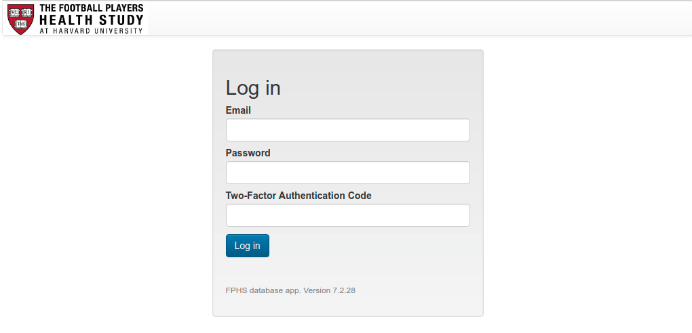
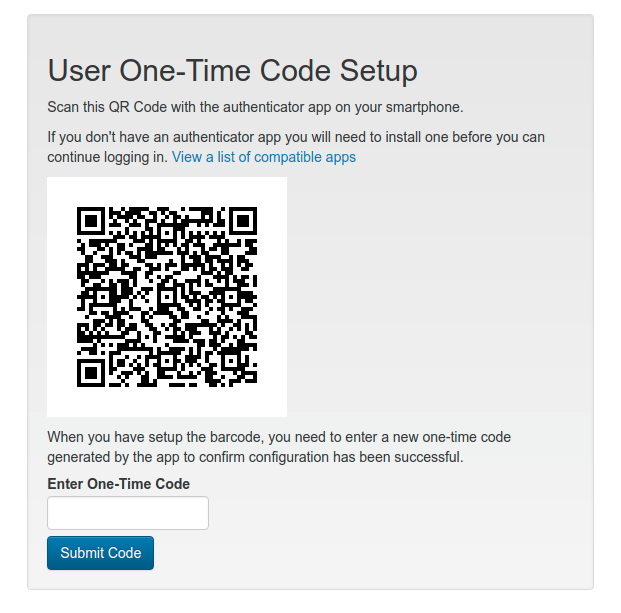
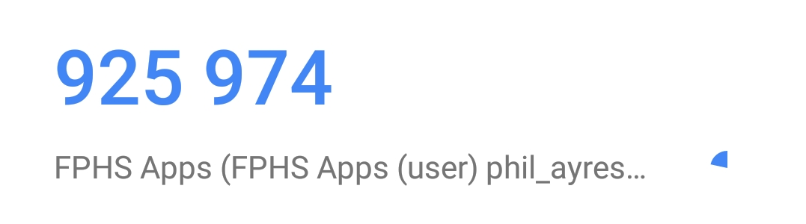
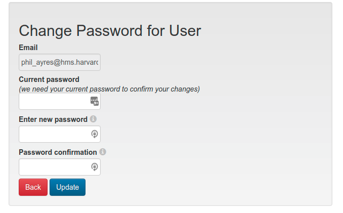
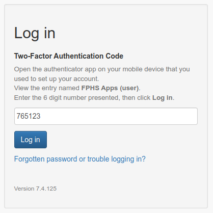
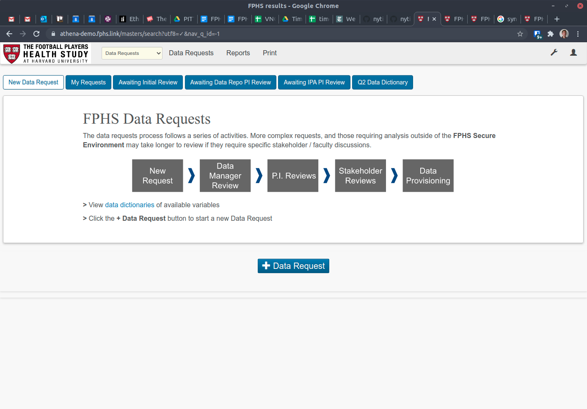

## Requesting a New Account

In order to use the Data Requests App, the requester must first have an account created on the app. This will provide them a username and password for login and authorization to use the Data Requests App. An account can be requested by completing the form:

[https://forms.gle/YAPu7fUK3sgxnsY66](https://www.google.com/url?q=https://forms.gle/YAPu7fUK3sgxnsY66&sa=D&source=editors&ust=1621003310365000&usg=AOvVaw1BliprUpvIP1lWxlH4oRsi)

NOTE: FPHS users of the Athena apps, such as IPA, Sleep Study, GRIT and PITT BHI will use their existing Athena username and password. They must still request access to the Data Request App through the previous link.

## Logging In

Login to the Data Requests App by browsing to: [https://athena-web.fphs.link](https://www.google.com/url?q=https://athena-web.fphs.link&sa=D&source=editors&ust=1621003310367000&usg=AOvVaw2pHqzg_rXZiMnnLpF_hzhS)

A simple login form will be displayed. You will need to enter your username and password to continue, then on the next page you will separately enter your two-factor authentication code (**except for the [first time that you login](#first-login)**).

IMPORTANT: if you see any other page than a Football Players Health Study login page (for example, a browser warning) or anything else that you don’t expect, do not continue. Close your browser tab and report it to the FPHS data team.

#### First login

The first time you login you should use the temporary password you were provided when your account was set up. Enter your username and temporary password, then click **Login**.

If you have not already done so, install a two-factor authenticator app on your smartphone. After logging in with your temporary password you will be presented with a dialog that displays a QR code to set up your two-factor authenticator app. On your smartphone, open the authenticator app, then find the option to add a new account (often a **+** button or *Add Account* menu item.) If given the option, you will add the account using a QR code. Point the smartphone camera at the QR code on screen to scan the barcode and add the account.

Two-Factor Authentication apps that are known to work well

Duo Mobile

Google Authenticator

Microsoft Authenticator

LastPass Authenticator

Authy

These should be freely installable from your device’s app store.

Once you have the new barcode added, the authenticator app should present a six digit number that updates every 30 seconds.

Enter this number (without the space) into the Two-Factor Authentication Code field and hit the Submit Code button. If the code is correct this will confirm that your app is set up correctly and can be used for future logins.

Now you will need to change your temporary password. Enter the temporary password that you were provided into Current password and a new password into the Enter new password and Password confirmation fields, then click Update. If you use a password manager, save this new password now.

After this step you will be taken to the home page. Future logins will not require all these steps.

#### Future logins

To login to the app for all future logins, go to the login page as before. The page will prompt you for your email and password. Enter these fields then click **Log in**.
{{#if mfa_disabled}} {{else}}On the next page you will be prompted for your two-factor authentication code.

Open the authenticator app on your smartphone and find the appropriate login in the list. View the 6-digit code that is displayed. Enter the code into the Two-Factor Authentication Code field and click Log in.

{{/if}}

If all of the entered details are correct, you will be logged in successfully and can continue using the app. If any one of the details is incorrect, you will need to try again.

Be aware that the two-factor authentication code is only valid for the time it is displayed on your smartphone app, plus up to another 30 seconds. If the time on your phone is incorrect then this extended period may be shorter, or may not work at all.

Only attempt to enter a two-factor authentication code once. The app prevents reuse of codes (even if a login failed), to avoid somebody looking over your shoulder from using a code you have used.

#### Logging in from bookmarks or notification emails

If you click a bookmarked search or report, or a link in an Data Requests notification email, you will be prompted to login if you do not already have an active session in your browser. After logging in you will be taken to the page you requested.

#### Forgotten password or locked account

You have 3 attempts to login successfully, after which point your account will be locked for one hour. If you have forgotten your password, or need your account unlocked faster, contact the FPHS data team for a password reset.

#### Lost two-factor authentication

If you uninstall the authenticator app on your smartphone or change your phone you will need to set up the authenticator app again. The FPHS data team can reset your code and you will need to go through the first time login process again.

## Home Page

Immediately after logging in, the home page should appear. This provides an introduction to the data requests process, menu tabs for starting new requests or finding existing requests, and a link to the library of data dictionaries for available datasets. Other tabs and menu items may be available to reviewers and the Data Manager.

To return to the home page at any time, click the Data Requests link in the top menu bar.

