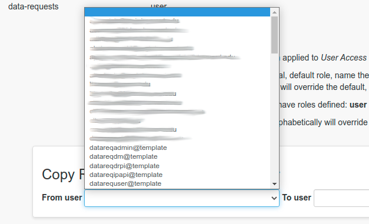

## Administration - Adding Users

The main task to be performed by administrators is the addition of users to the application.

Login to the app at [https://athena-web.fphs.link](https://athena-web.fphs.link) as a regular user, then login as an administrator.

Switch to the Data Requests app from the drop down menu next to the logo.

In the Usernames and Passwords panel, validate the user is active, or add the new user account if necessary

In the User Roles page, scroll to the end of the page to the Copy Roles from One User to Another panel

Select the template user to copy roles from in the From user drop down

The available templates are:

* datarequser@template - a regular user making data requests
* datareqdrpi@template - PI for the Data Repository
* datareqipapi@template - PI for IPA
* datareqdm@template - data manager roles
* datareqadmin@template - app admin

Select To user to be the new user to add to the app.

Ensure the app type is Data Requests, then save.

NOTE: this method can not be used to change the existing role of a user. In this case, view the available roles for the desired template, then add and remove roles for the target user by hand.
