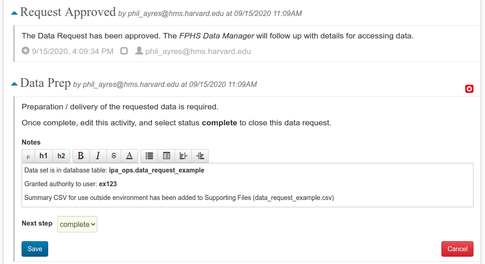
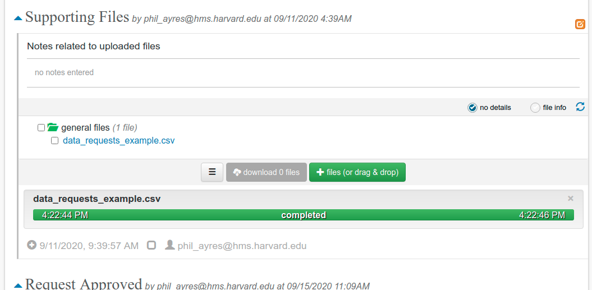

## Data Manager: Data Prep

When all necessary reviews have been completed, the Data Manager will receive an email notification that the request is ready for fulfillment. The Data Prep activity allows information about the data set to be captured.

If data files (CSVs for example) are to be provided to a requester for use outside of the Secure Environment, the Data Manager may send them using the Harvard File Transfer tool, or upload them directly to the data request Supporting Files folder.

Back in the Data Prep activity, on completion of the request, set the Next step to complete to close the data request.

