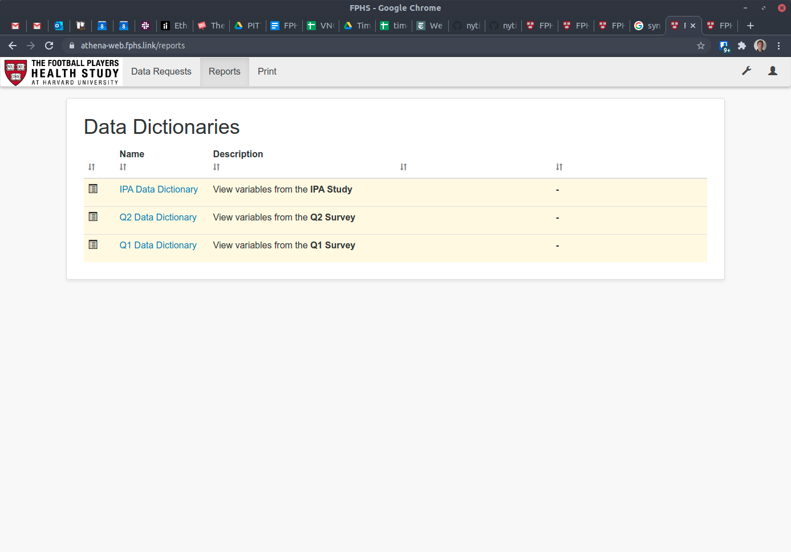
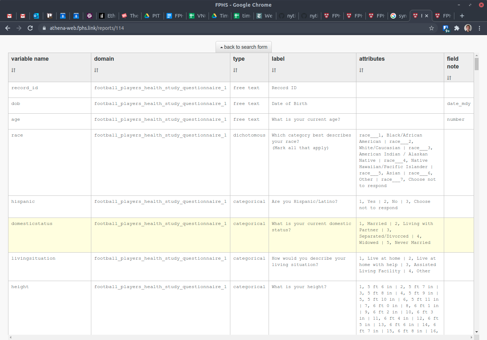
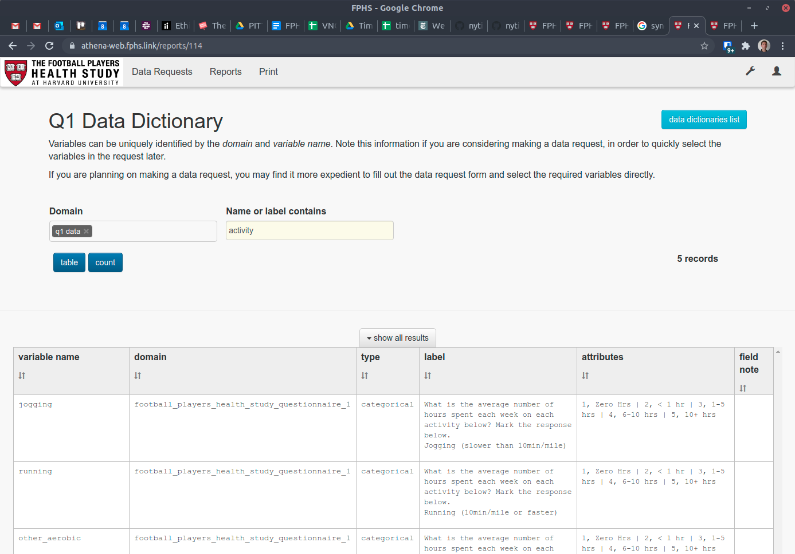

## Home Page

Immediately after logging in, the home page should appear. This provides an introduction to the data requests process, menu tabs for starting new requests or finding existing requests, and a link to the library of data dictionaries for available datasets. Other tabs and menu items may be available to reviewers and the Data Manager.

To return to the home page at any time, click the Data Requests link in the top menu bar.

## Reviewing Available Datasets

Prior to making a request it is possible to view the library of data dictionaries for available datasets. Click the blue data dictionaries link in the summary section.

A list of data dictionaries appears:

Click a link to view the appropriate item. By default the full set of variables is displayed:

To filter the selection of variables, click the tab back to search form that appears at the top of the table. Optionally select one or more domains or enter a word or phrase the variable name or description must contain. Click table to refresh the list.

To return to the list of data dictionaries click the light blue button on the right hand side, data dictionaries list. Alternatively, to return to the home page, click Data Requests (or the FPHS logo) in the top menu bar.

