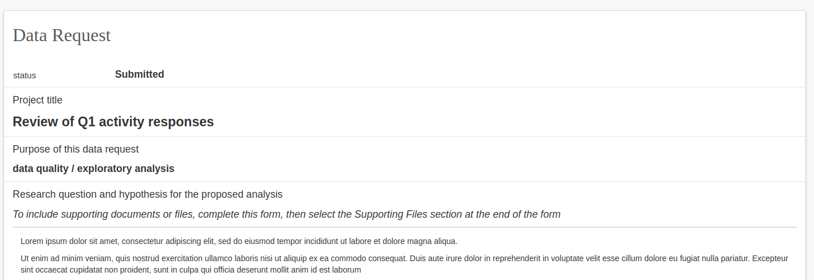

## Data Manager: Initial Review

Immediately after a data request is submitted, the FPHS Data Manager will receive a notification of a new request, and will have the opportunity to review the request, classify it based on required data variables and request additional information from the requester if needed.

Requests that are ready for initial review can be listed by clicking the search tab Awaiting Initial Review

A list of items awaiting review will be returned, or if there is only one it will be automatically opened.

All of the request form fields as entered by the requester can be viewed.

Scrolling to the end of the request shows a link icon for viewing all the selected variables.

Clicking the icon, a table of variables appears:

At the end of the request form, a button \+ Initial Review opens a form for capturing the results of the review.

The initial review form appears like this:

Each of the selected fields drive rules around which subsequent reviews are required (IPA, Data Repository, Faculty, etc.) Careful review of the selected variables should allow the appropriate classes of data to be selected.

On selecting yes to the field Is the review complete?, a new question is revealed:

Approve or reject the request by responding, then click Save. Alternatively, if you are not ready to complete the review but just want to save the current entries for later, select no for Is the review complete? and click Save.

When the review is completed and approved the appropriate PIs are notified that their reviews are required and the process continues.

If the review is rejected, the requester is notified and the process ends.

- - -

