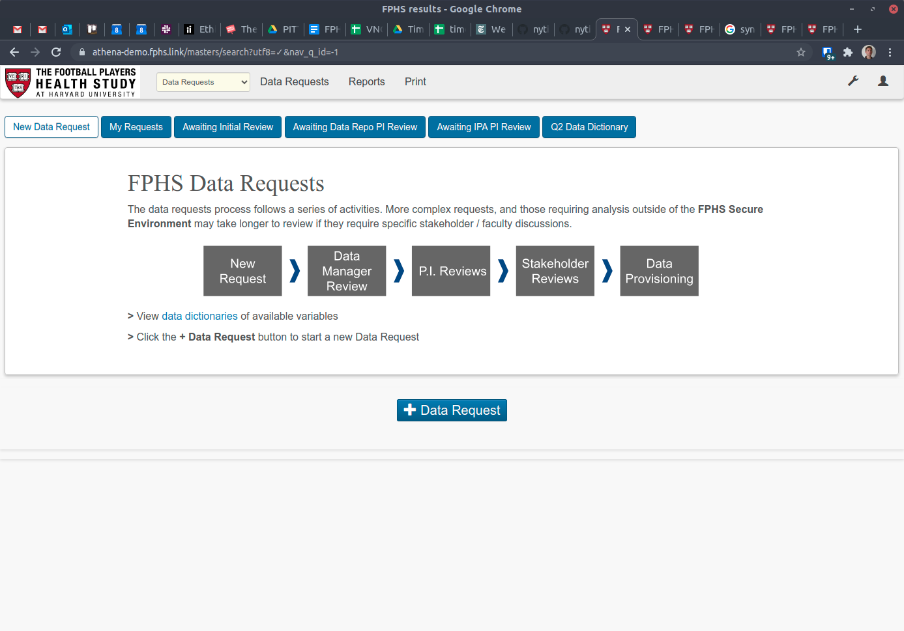
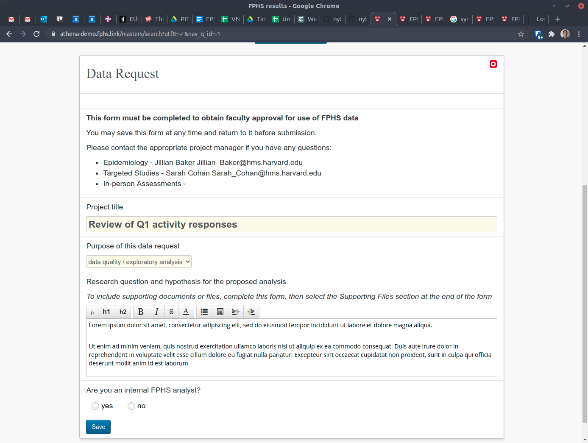
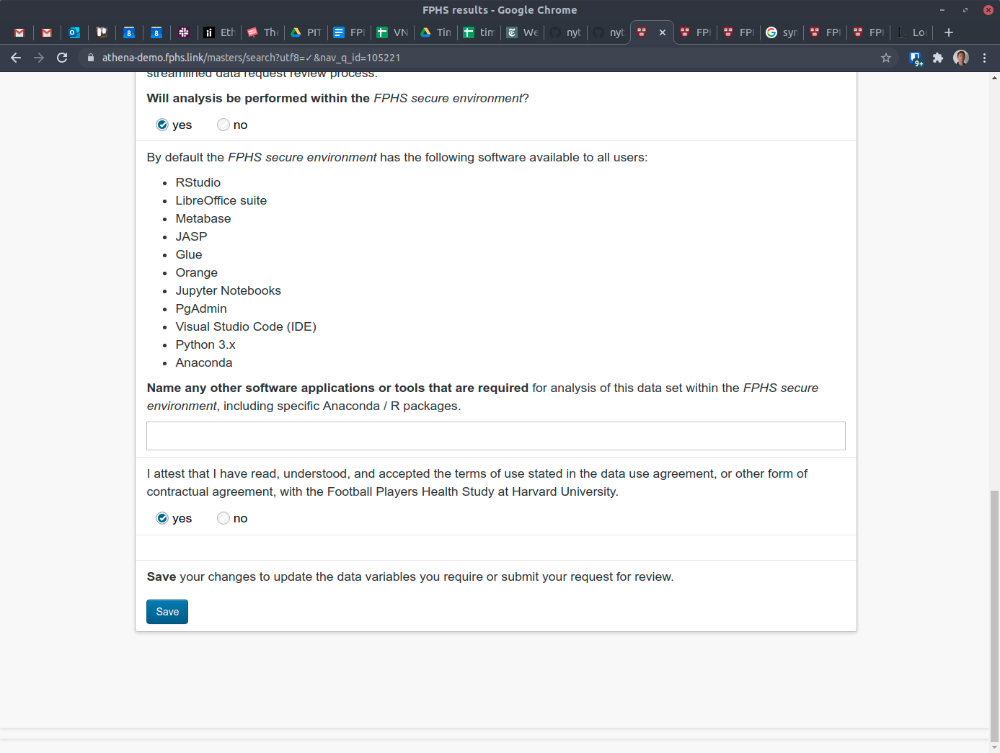
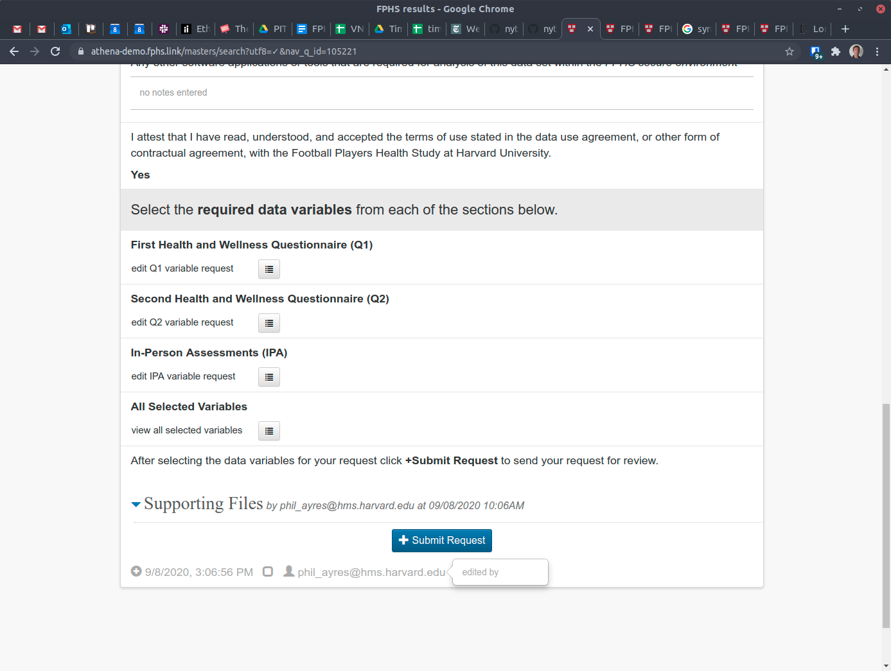
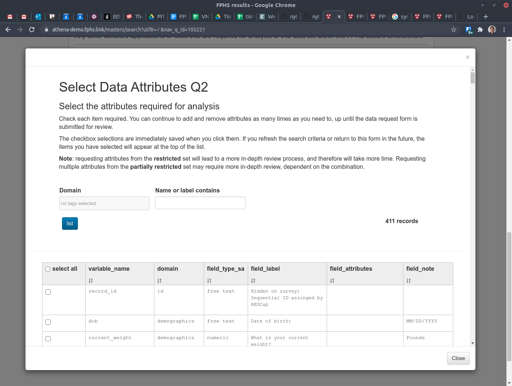
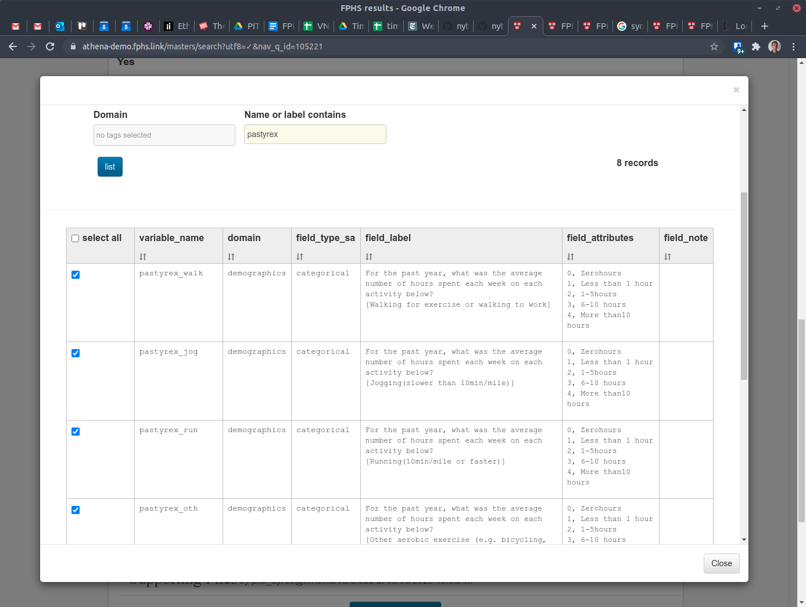
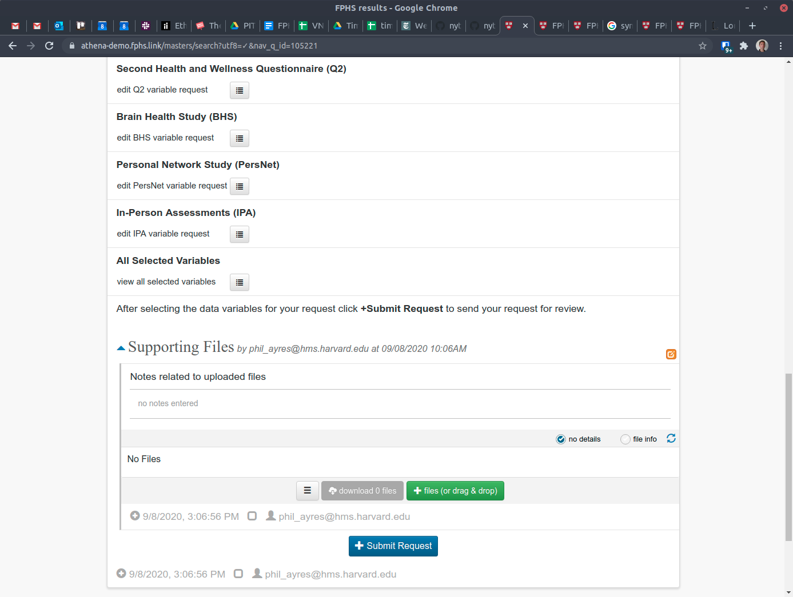
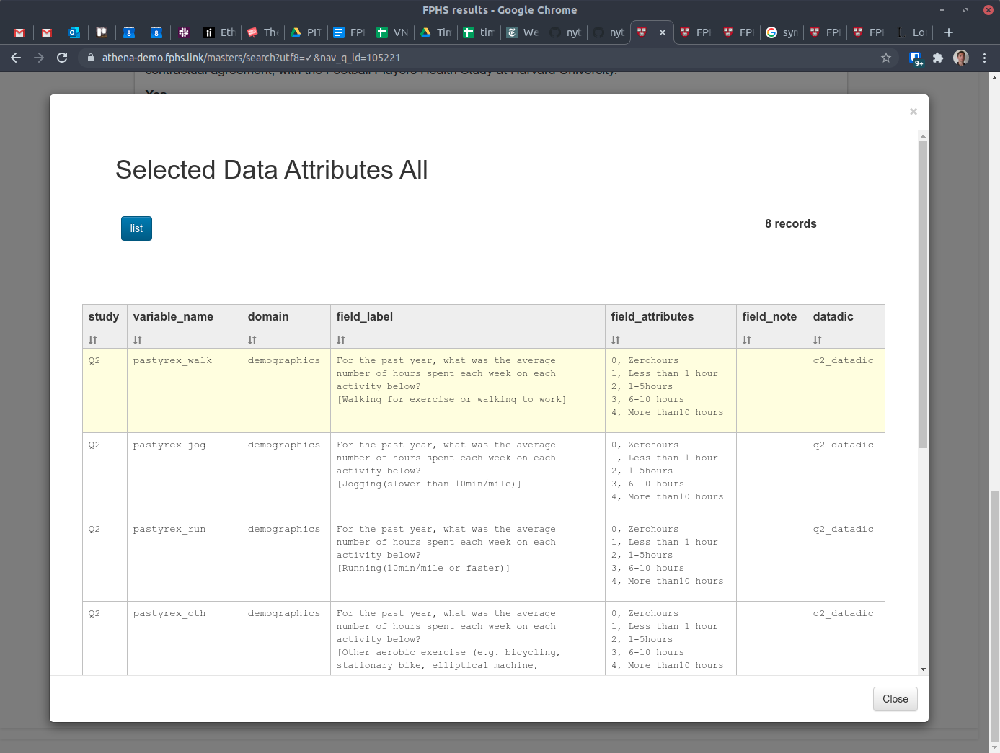
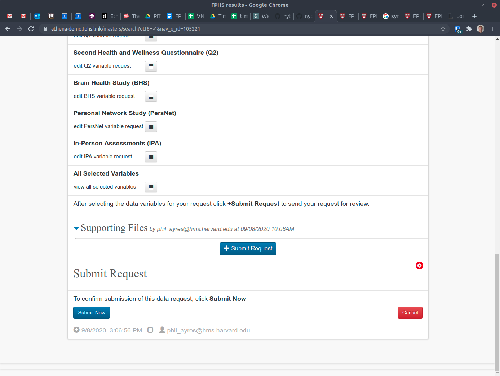

## Making a New Request

### Request Form

To make a new request for FPHS data, click the large blue button \+ Data Request on the home page below the summary block.

A new data request form will appear:

Enter all the requested fields, drop down selections, yes / no radio buttons and free text blocks. As certain selections are made, new fields will be revealed.

On completing all the fields you will see a final caption:

Click Save to save the form and start the process of selecting the data variables you require.

### Selecting Data Variables

When saved, the request form will be updated to show the available data dictionaries from which variables may be selected. Scroll to the end of the form:

Click the icon ≣ next to the required dataset to show the selection form:

The domain and name or label contains fields provide immediate filtering of the results in the list below. To select a variable to be requested, click the checkbox on the left. To unselect it, click again to uncheck the box. Changes to the selections are immediately saved.

When complete, click the Close button in the bottom right corner. You may return to the selections list at any time before finally submitting your request.

### Add Supporting Documents

If necessary, you can upload additional documents to support your request. Drop down the Supporting Files block with the ⏷ icon. Files can be added by clicking the green \+ Files button, or by dragging one or more files from your desktop file explorer onto the block. Click an uploaded filename to view or download it.

### Submitting the Request

Prior to submitting the request, it is prudent to review the requested variables. Click the

All Selected Variables ≣ icon to view the list of selected items across all datasets.

When you are comfortable with the selections, click the \+ Submit Request button, which will reveal a confirmation form. Click Submit Now or Cancel as appropriate.

On submitting the request, the FPHS Data Manager will be notified of your request.

