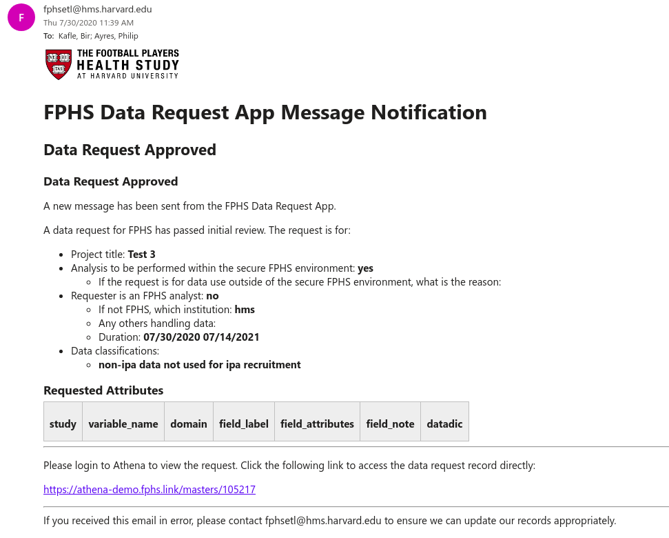

## Viewing My Requests

To view requests that you have created, click the My Requests search tab. The list of all submitted or new unsubmitted requests will be displayed.

Clicking a heading of an item will expand the section to show the request.

If the request has not been submitted yet, it can be edited by clicking the orange edit icon. If already submitted, it will not be possible to edit the submission.

## Notifications

Users of the app will receive email notifications at appropriate points in the process, when additional information is required from them or the request has been approved or rejected

Email notifications appear like:

