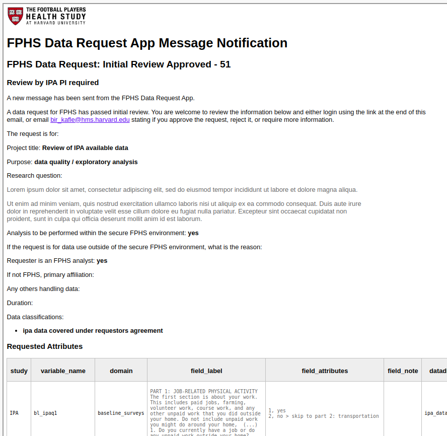
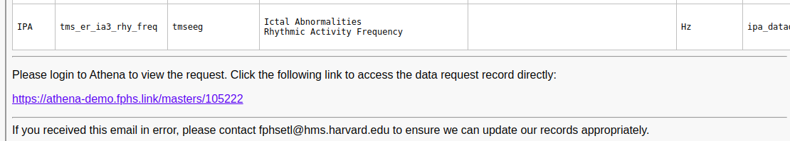
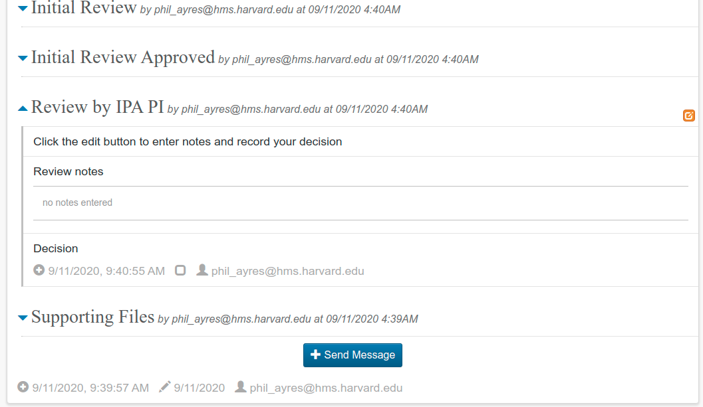
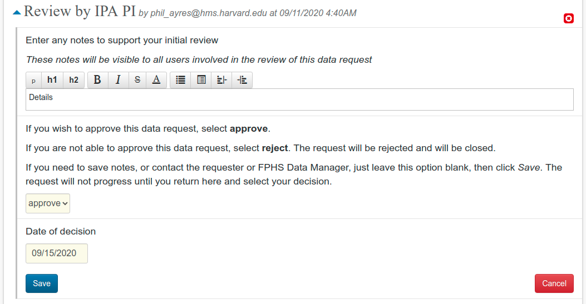

## PI Reviews

After the FPHS Data Manager has completed and approved the initial review, the appropriate PIs will receive an email notification that shows the key details entered by the Data Manager, and the requested variables.

...

An email can be sent to the Data Manager approving, rejecting or requesting more information about the request. The Data Manager has the ability to set a decision in the app on behalf of the PI. Alternatively, the link at the end of the email notification can be clicked to jump straight to the request online, after logging in.

Within the app, the PI review appears ready to be completed. Dropping the details down shows the orange edit button.

On editing, select the Decision (approve / reject) and the date:

