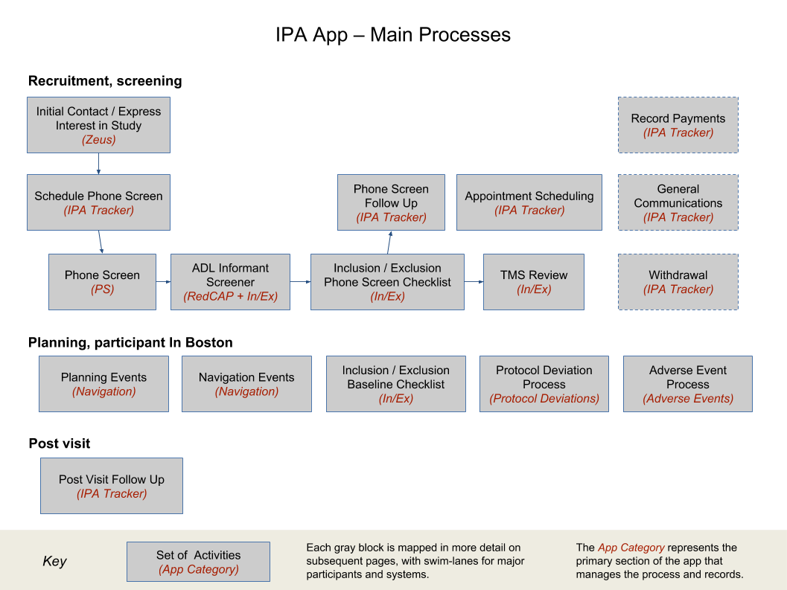

# Athena, the In-Person Assessment (IPA) App

# Background

The Athena In-Person Assessment (IPA) app provides a secure environment for coordinating and recording interactions between study participants, FPHS staff, Navigators and PI. It allows for PHI data and files to be captured without relying on external secure transfer or storage apps.

The scope of the app starts from the point in time that a player expresses an interest in the IPA study, through to exclusion, withdrawal or completion. The following diagram shows the main processes that are managed:

In addition to choreographing processes to streamline common activities and capture essential information, the app also enforces certain requirements of the protocol around which users can see what data at certain times, to assist in compliance and subsequent audit.

# About this Document

This document is intended to provide a high-level overview of the IPA Athena app. It is a source of [links to all related user documents](#h.vvvq7vbldjd), describing the app and processes in more detail.

Users that are familiar with the app may find it most useful to locate the specific processes they are involved with to deep-dive to the details. A quick skim of the App Usage section may reveal some interesting UI features that are new, and the Searches, Work Queues and Reports section may highlight useful ways to find the participant information.

The following is a description of each of the sections:

[App Usage](app_usage)  
A description of the app and its user interface. Each of the main components of the UI and the participant record are described, plus common components such as File Storage and Reports.

[Key Processes](key_processes)

The specific IPA processes are summarized in this section, flowing from the very start of interactions with a player in Zeus, through to a participant’s exit or completion of the study.

Each process is detailed in its own document, and these documents are linked from the individual process descriptions.

[Study Exit](study_exit)

A description of the rules around how to record a participant exiting from the study, and what happens to the data when this occurs.

[User Roles](user_roles)

A definition of the high-level user roles, which are used to define the specific features and data that each user has access to.

[Searches, Work Queues and Reports](searches_work_queues_and_reports)

A definition of each of the searches, work queues and reports that a user has access to. The use of each is described, to help users get the correct information they are looking for.

