# App Usage

The Athena app aims to provide a User Interface that is easy to use without specific training. The approach is to present a complete view of the large number of records and activities related to a participant in a compact way.

This section provides a description of the general usage of the app.

The main components of the user interface are:

* Login
* Search and Work Queues
* Participant Record
* Reports
* Emails and SMS notifications
* Change Password
* Logout

## Login

Login to Athena by connecting to the app VPN then browsing to: [https://athena.fphs.link](https://athena.fphs.link)

A simple login form will be displayed. You will need to enter your username and password to continue, then on the next page you will separately enter your two-factor authentication code (**except for the [first time that you login](#first-login)**).

IMPORTANT: if you see any other page than a Football Players Health Study login page (for example, a browser warning) or anything else that you don’t expect, do not continue. Close your browser tab and report it to the FPHS data team.

### First login

The first time you login you should use the temporary password you were provided when your account was set up. Enter your username and temporary password, then click **Login**.

If you have not already done so, install a two-factor authenticator app on your smartphone. After logging in with your temporary password you will be presented with a dialog that displays a QR code to set up your two-factor authenticator app. On your smartphone, open the authenticator app, then find the option to add a new account (often a **+** button or *Add Account* menu item.) If given the option, you will add the account using a QR code. Point the smartphone camera at the QR code on screen to scan the barcode and add the account.

Two-Factor Authentication apps that are known to work well

Duo Mobile

Google Authenticator

Microsoft Authenticator

LastPass Authenticator

These should be freely installable from your device’s app store.

Once you have the new barcode added, the authenticator app should present a six digit number that updates every 30 seconds.

Enter this number (without the space) into the Two-Factor Authentication Code field and hit the Submit Code button. If the code is correct this will confirm that your app is set up correctly and can be used for future logins.

Now you will need to change your temporary password. Enter the temporary password that you were provided into Current password and a new password into the Enter new password and Password confirmation fields, then click Update. If you use a password manager, save this new password now.

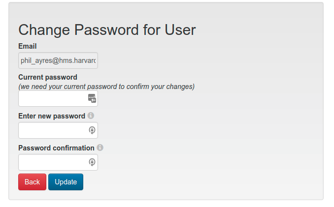

After this step you will be taken to the home page. Future logins will not require all these steps.

### Future logins

To login to the app for all future logins, go to the login page as before. The page will prompt you for your email and password. Enter these fields then click **Log in**.
{{#if mfa_disabled}} {{else}}On the next page you will be prompted for your two-factor authentication code.

Open the authenticator app on your smartphone and find the appropriate login in the list. View the 6-digit code that is displayed. Enter the code into the Two-Factor Authentication Code field and click Log in.

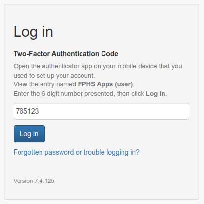
{{/if}}

If all of the entered details are correct, you will be logged in successfully and can continue using the app. If any one of the details is incorrect, you will need to try again.

Be aware that the two-factor authentication code is only valid for the time it is displayed on your smartphone app, plus up to another 30 seconds. If the time on your phone is incorrect then this extended period may be shorter, or may not work at all.

Only attempt to enter a two-factor authentication code once. The app prevents reuse of codes (even if a login failed), to avoid somebody looking over your shoulder from using a code you have used.

### Logging in from bookmarks or notification emails

If you click a bookmarked search or report, or a link in an Athena notification email, you will be prompted to login if you do not already have an active session in your browser. After logging in you will be taken to the page you requested.

### Forgotten password or locked account

You have 3 attempts to login successfully, after which point your account will be locked for one hour. If you have forgotten your password, or need your account unlocked faster, contact the FPHS data team for a password reset.

### Lost two-factor authentication

If you uninstall the authenticator app on your smartphone or change your phone you will need to set up the authenticator app again. The FPHS data team can reset your code and you will need to go through the first time login process again.

## Search and Work Queues

The main page provides a series of buttons underneath the navigation bar that show the different Search and Work Queues available to the current user. All users have a search form by default that allows for searching participants by IPA ID. Users with privileges to view identifying participant details will receive a search form that also allow the search to be performed by name.

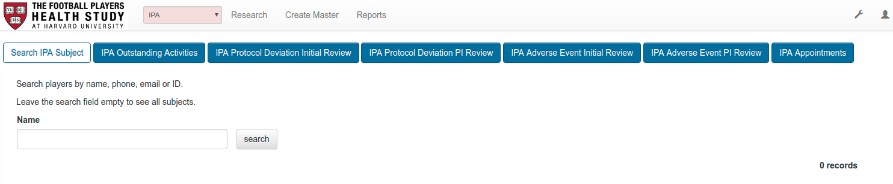

Each search presents a simple form for specifying search criteria.

A work queue is a specialized search that runs automatically, showing a queue of subjects matching predefined criteria, such as certain tasks outstanding. The results are presented as a list of matching subjects, or if only a single result is matched that subject it will be expanded automatically.

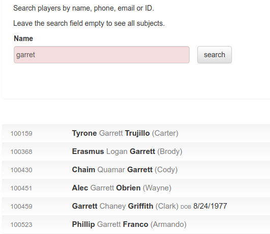

Clicking a result expands the subject’s information within the list. The results list acts as an accordion, shrinking any previously opened items, while retaining the full list of results. This allows a user to rapidly view (and optionally edit) multiple subjects in a result set without having to repeat the search.

The types of searches available to users are described in [Searches and Work Queues](searches_work_queues_and_reports).

## Participant Record

When a search result is expanded, a participant record is revealed. This provides a single view for viewing, editing and creating records and activities related to a study participant.

At the top of each participant record a summary bar shows the IPA ID. If the user has privileges to see identifying participant details, the name and date of birth are also shown.

Each of the app’s key processes and the participant details (if the user has appropriate privileges to view them) records are available in separate panels, each expanded by clicking the tabs under the participant’s summary information.

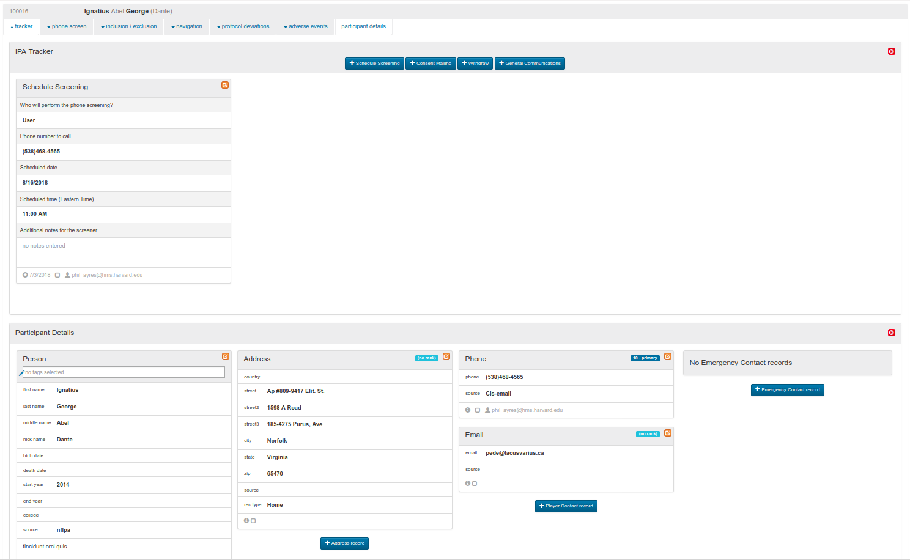

Most of the process tabs, such as IPA Tracker, Phone Screen, Adverse Events and Protocol Deviations show individual activities records specific to the participant as cards. These record cards are presented in reverse chronological order, so that the latest card is presented first in the panel. As one row is filled the later cards will wrap onto the next row.

To add a new activity record, click the appropriate blue button at the top of the panel, such as + Consent Mailing.

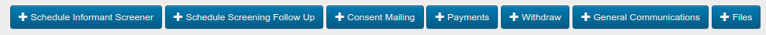

The activity form appears as the first item in the list below, before any existing cards.

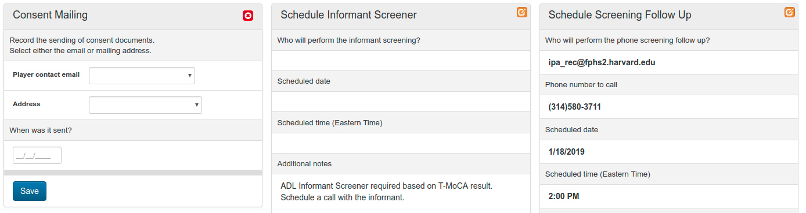

Enter the appropriate information and click Save to record the activity.

Unless specific rules prevent it, the most cards may be subsequently edited by clicking the edit icon in the top corner or the card.

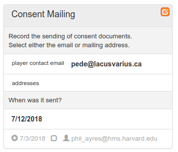

Certain processes, such as Protocol Deviations and Adverse Events keep all related activity records self-contained within an item. A Protocol Deviation for example, contains its complete review process within a single card, with each review sub-activity appearing below the previous activity. New forms appear below the main form. Saved items appear with a title and an arrow to expand the full details of the item. The follow shows an example of both views:

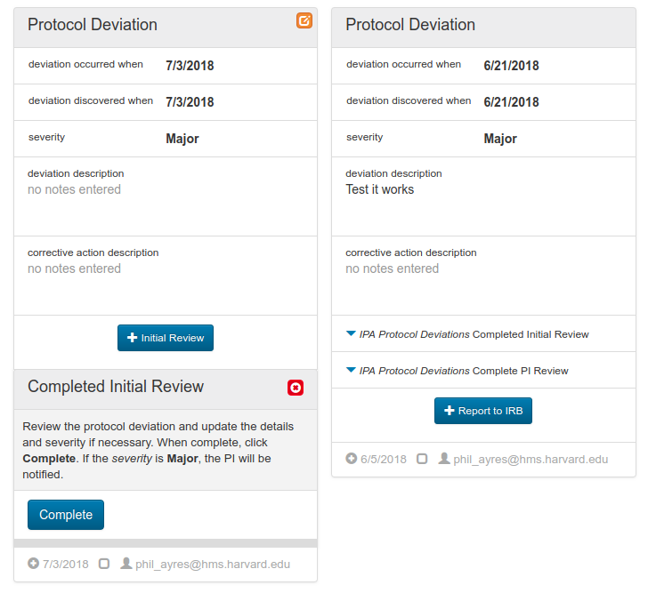

Participant Details records such as the Person, Address, Phone, Email and Emergency Contact cards are static information. These items appear in a single panel, and may be edited at any time. Where it is possible to add new items, such as and Address, the new cards will appear vertically, in an order based on the assigned rank (typically primary, secondary, bad contact).

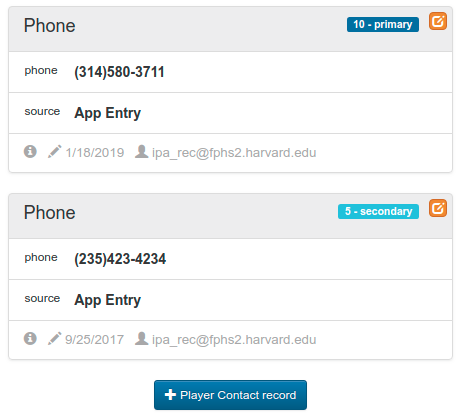

## File Storage

Certain activities provide the ability to attach files and documents to them. Stored files are permanently attached to the activity record, stored securely, and available for retrieval only by users with appropriate privileges.

In this example, several files have been attached to an activity specifically intended for file storage. Clicking any filename either downloads it, or opens it in Secure-View, an online viewer that allows common document types to be viewed directly in the browser without requiring them to be downloaded to the desktop. Selecting multiple files with the checkbox then clicking the download button downloads a zip file of all the selected items.

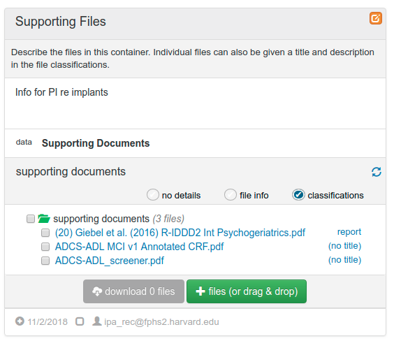

To attach files, drag-and-drop them onto the file storage block, or click the green \+ files (...) button and select one or more files. In the file selection dialog just select a file or use the following key / mouse combinations to select multiple files:

* Click first file then Shift + Click to select a block of files
* Ctrl + Click (PC) or Cmd + Click (Mac) to select each individual file

Uploading a zip file will lead to the file being expanded to its component files (typically after several seconds or when the page or the circular refresh symbol on the right hand side is clicked).

The radio buttons labeled no detail, file info, and classifications provide different views of the file list. Classifications reveals extended document metadata. This can be edited by clicking the (no title) link. This allows for records to be identified in more detail, and descriptions to be added.

### Secure-View

Secure-View is an online viewer that allows common document types to be viewed directly in the browser without requiring them to be downloaded to the desktop. For users that have the facility enabled, clicking an uploaded file listed in the browser will open display the viewer interface.

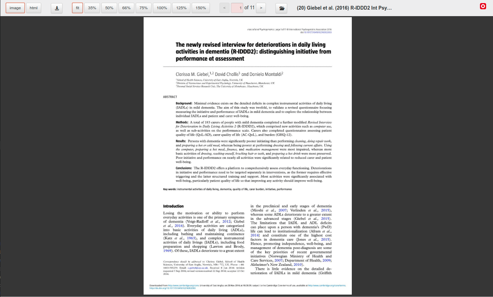

The top menu bar provides the following controls (in order from left to right):

* View as an image (the default view) or as HTML to allow copy and paste (if the user has permission)
* Download (if the user has permission)
* Zoom as fit to page, or various percentages
* Page forward and back, or enter a page number
* Drop down a file list to select a different file or view a file’s metadata
* Close the viewer (the red button on the right hand side)

## Reports

Reports are configured by app administrators to meet more complex data retrieval (and possibly editing) needs, especially where a tabular view of results is required rather than the participant summary list provided by Search.

Reports are accessed by clicking the Reports menu item. This presents a list of reports that are available to the user. It should be noted that individual users may have access to different reports, based on their role.

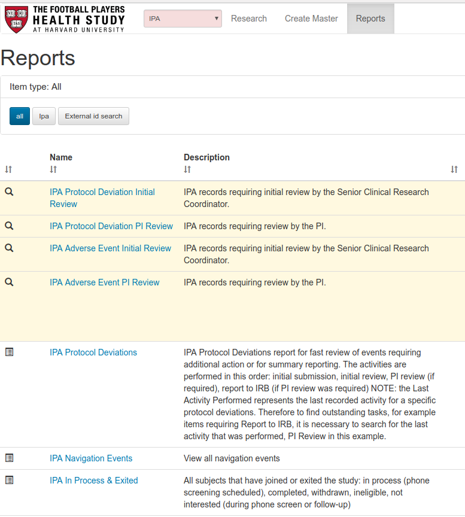

In the Reports list click the report name link to access a report.

Typically a report displays a criteria form with fields that are optional or mandatory, dependent on the definition. Certain fields allow for multiple selections to be made; add items by clicking into the field, and remove items by clicking the x icon on the item to be removed.

Fill the fields as appropriate and click one of the action buttons:

* table \- executes the search and returns a tabular list of results
* count \- performs a count, returning just the number of results

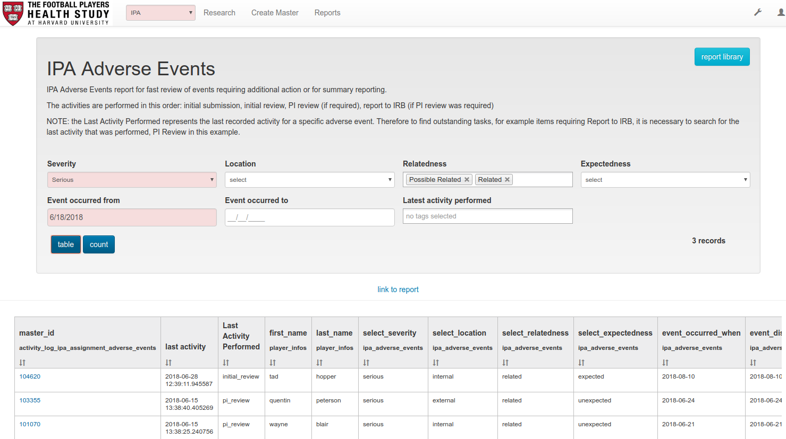

The table’s column headers can be clicked to order the results. To sort by additional fields (for example, by select\_severity, then select\_location in the screenshot), click the first field header, then hold the Shift key and click the next field header. In most reports the participant’s name is not shown, instead only allowing identification by IPA ID.

To view a participant’s full records in a standard view, click the link in the master\_id field. This opens in a new tab.

If you have set criteria that you would like to reuse regularly in the future, click link to report and save the page as a bookmark in your browser. Only the URL is saved. The report query is re-run when this link is used, ensuring data remains securely in the app, and results are based on current data when the report is run.

To return to the list of reports, click the report library button, or the Reports menu item.

A description of the available IPA reports is available in the [Reports](searches_work_queues_and_reports) section.

## Email and SMS Notifications

As users complete specific activities in the Athena processes, the app may be configured to send an email or SMS notification. The aim of these notifications is to inform a user that a specific activity has been performed by another user, and that new information or required actions are available in the app. No data from the app is included in notifications.

An example email appears like this:

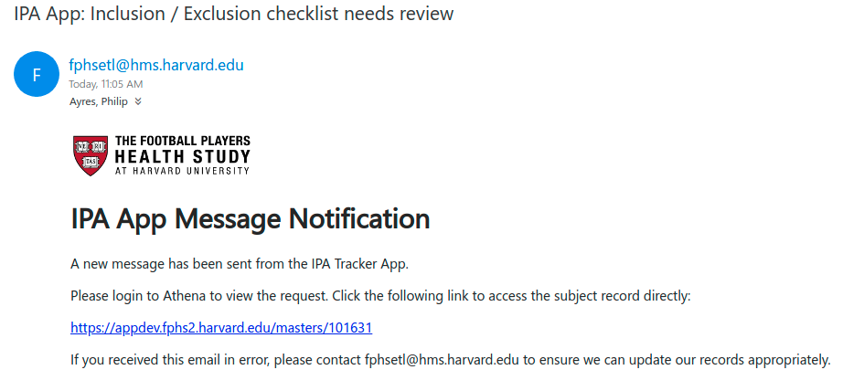

The subject of the email typically summarizes what activity has been completed, or the action that is required of the recipient.

The body of the message includes a link to the participant record, allowing a direct click from the email to open the correct record in the app. Of course, this will only work on devices that are running the app VPN. If the browser opens but just spins, it is likely that you need to connect to the VPN to complete the request. Clicking a link on your smartphone will therefore not open the page.

In some cases, the email will direct the user to the process panel referenced by the email. In other cases it may be necessary to open the required panel and review the information to see exactly what is required. The first card in a panel typically represents the reason for the notification. For activities that are intended for communication between users, the card will typically contain the full message that the sender wished communicate.

SMS notifications work in a similar way, although due to length (and formatting) restrictions, the amount of text is limited. Rather than sending a URL in the message, the IPA ID is provided, allowing the user to search for this in the app’s primary search box.

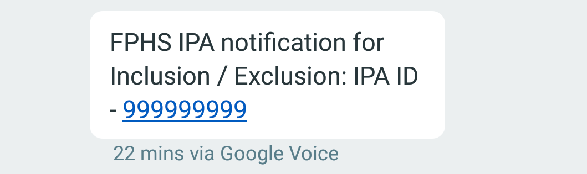

In most cases SMS notifications are sent at the same time as a more detailed email notification. If working on the VPN connected device, checking your email inbox may be a good way to get to the participant’s record quickly.

NOTE: some notifications are directed to a role, rather than just an individual user. If this is the case, take care to ensure you don’t duplicate effort by agreeing with other users who will respond to a message or assignment.

## Change Password

When logged in, a user is able to change his or her password. Click the account button on the right hand end of the navigation bar, then pick the password option.

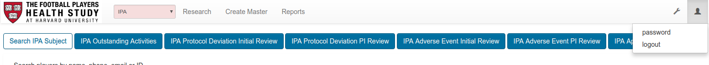

A password change form will be presented. Enter your current password, then enter your new password and confirm it.

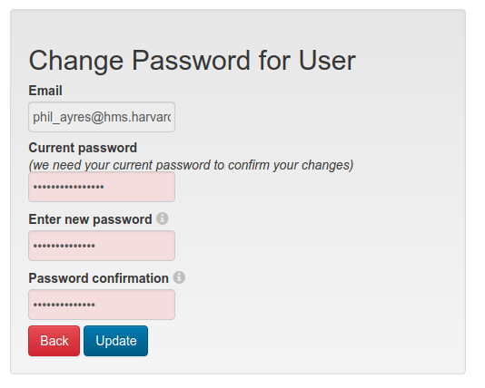

Password complexity rules are enforced. A password of at least 10 character is required. Special characters and spaces are acceptable. Completely random passwords (such as those produced by a password manager) work well, as do long ‘sentences’ of random words (for example, “Duck yellow quick picture-frame”).

Note that the previous five passwords can not be reused when changing your password.

### Password Expiration

User’s passwords must be routinely changed within 90 days. The app will display a prompt after login if the expiration of a password is due within the next 5 days, providing the user the opportunity to go and change the password immediately.

The app will send a notification to users 5 days before a password expires, as a prompt to login and change the password to avoid its expiration.

When a password has expired the user account will be locked. It can only be unlocked by an administrator performing a password reset.

## Logout

To logout, click the account button on the menu bar, then pick the logout option.

If you do not logout and are inactive in the app (have not clicked to view, edit or save data) for 30 minutes, you will be automatically logged out. If the app is active in your current browser tab then you will be presented with an alert offering you the opportunity to remain logged-in without having to refresh the page.

- - -
