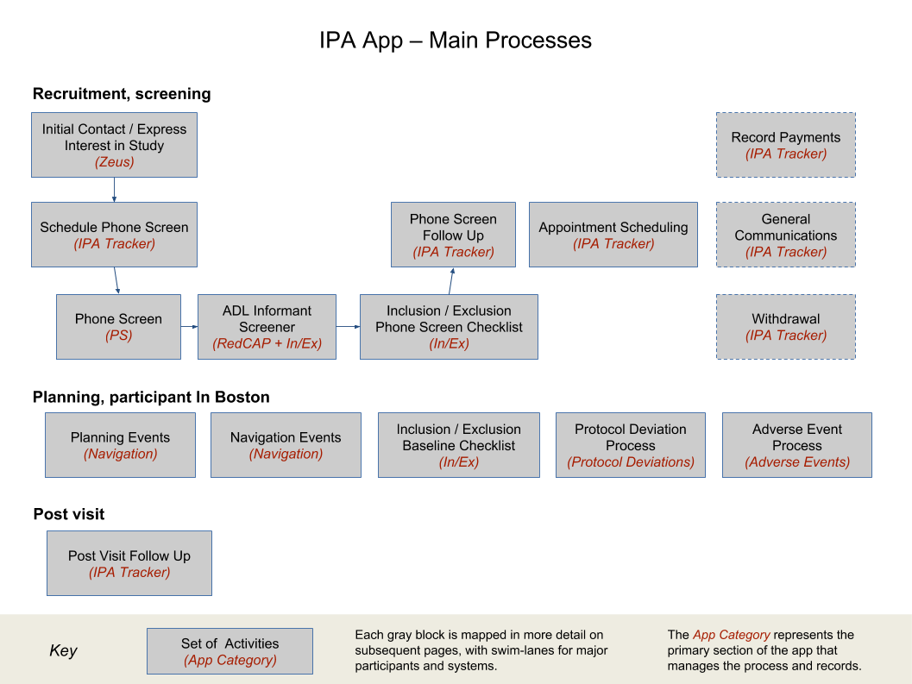

# Key Processes

Each of the key processes addressed by the app are described at a high level in this section, and detailed in its owned document (see links below.)

The narrative follows the “happy path” (the most common sequence of activities) from beginning to end, addressing major exceptions to the process where appropriate. Of course there are many other activities and tasks performed outside of the app that are not detailed here; their exclusion is purely for simplicity. If readers feel that extra context or descriptions of follow-up activities would be useful, feel free to add a comment to the appropriate document directly.

## Key Process Documents

* [IPA Zeus - IPA Recruitment Ranks Report](https://www.google.com/url?q=https://docs.google.com/document/d/1Qgadya0zzHOEAQ4VXZFcCn_5vqX_UoZ3kPA4UfFIwgE/edit?usp%3Dsharing&sa=D&source=editors&ust=1620932913333000&usg=AOvVaw1n7_aj3zHBmlH3y5TydDaD)
* [IPA Athena: Phone Screen Process](https://www.google.com/url?q=https://docs.google.com/document/d/142iKwkxOJ6SaESiQjZm5kIZ7Q0fQRHOeVRsR1oG-RZA/edit?usp%3Dsharing&sa=D&source=editors&ust=1620932913334000&usg=AOvVaw0sdlRALvHp4POw6Tz-MNKI)
* [IPA Athena: Inclusion / Exclusion process](https://www.google.com/url?q=https://docs.google.com/document/d/1q18fwSgXeouOwOQ_vCx8yzrpbmTltgJN1DdptjRtiL8/edit?usp%3Dsharing&sa=D&source=editors&ust=1620932913334000&usg=AOvVaw1x_LUqJKbinT97GO3pPR-i)
* [IPA Athena: Screening Follow Up Process](https://www.google.com/url?q=https://docs.google.com/document/d/1FyHMbBBQtBeM2O0abtsomaf-ms1uieS-02ORDa5SPdQ/edit?usp%3Dsharing&sa=D&source=editors&ust=1620932913335000&usg=AOvVaw1EP5YVVViEeFFplFc1iUaS)
* [IPA Athena: Navigation Process](https://www.google.com/url?q=https://docs.google.com/document/d/1SBMfcDlI4Ma9_s2vVWP_vnzbeg8bm2S1rimLLktCQyI/edit?usp%3Dsharing&sa=D&source=editors&ust=1620932913335000&usg=AOvVaw112IlDJ2hbF5SHekT1KkY5)
* [IPA Athena: Adverse Events and Protocol Deviations](https://www.google.com/url?q=https://docs.google.com/document/d/16JmzCvAv_7jThGlfpHQCgeZtQl2C6Wqaw0Y5pKgav5Y/edit?usp%3Dsharing&sa=D&source=editors&ust=1620932913336000&usg=AOvVaw0y7naovm9w8rP8UekQMbkg)
* [IPA Athena: General IPA Tracker Activities](https://www.google.com/url?q=https://docs.google.com/document/d/1JHVkUGw2flyNqLEIojE1ONV-Z5donxotyt1RCszuO-o/edit?usp%3Dsharing&sa=D&source=editors&ust=1620932913337000&usg=AOvVaw2ou6mCrdWmIFsp3sxlkyqs)
* [IPA Athena: Sample Lifecycle Tracking](https://www.google.com/url?q=https://docs.google.com/document/u/1/d/1_shweQ12EnWihNProWJs8tE6trTs9Nc0GIFi6QGhR20/edit&sa=D&source=editors&ust=1620932913337000&usg=AOvVaw0fICXR8ee7q8BwGBluJvs_)

    - - -

## Initial Contact / Express Interest In Study

FPHS staff are responsible for identifying and contacting players that appear to meet the requirements of the study.

Zeus allows specific users to search a small subset of data from Q1, allowing them to filter players based on their ailments and age range. See [IPA Zeus - IPA Recruitment Ranks Report](https://www.google.com/url?q=https://docs.google.com/document/d/1Qgadya0zzHOEAQ4VXZFcCn_5vqX_UoZ3kPA4UfFIwgE/edit?usp%3Dsharing&sa=D&source=editors&ust=1620932913338000&usg=AOvVaw0BrypY6tO66tPWkjGipsDL) for more details.

Having identified players to contact, the standard Zeus tracking features are available. By adding a tracker entry, IPA - Contacted Player, multiple staff members working from the same list can avoid contacting the same player unnecessarily multiple times.

When a player expresses an interest in the study, the Staff Member will enter a tracker entry, IPA - Start Recruitment, indicating this. An effect of this is to trigger a transfer of the player’s details, including contact information, over to Athena. A background process carries out this transfer within a few minutes.

Interactions by staff with the participant should now be recorded by users in Athena rather than Zeus, through to the point that the participant eventually exits the IPA study. Withdrawal, ineligibility and completion events are transferred back to Zeus and recorded in the tracker automatically.

## Schedule Phone Screen

The Athena processes start when a Staff Member schedules a phone screening with the new participant. Ideally, this will be recorded in real time in Athena in the IPA Tracker process.

It is also possible that a Staff Member will schedule a phone screen with the player prior to the Zeus IPA - Start Recruitment tracker record being added and the player’s details being transferred to Athena. In this case the Staff Member will most likely need to handle the scheduling offline, subsequently entering it into Athena when the player information is available in the app.

For convenience, Zeus users will be able to access Athena in the same browser as Zeus (within the secure Putty/VNC connection) using the URL [https://app-internal.fphs2.harvard.edu](https://www.google.com/url?q=https://app-internal.fphs2.harvard.edu&sa=D&source=editors&ust=1620932913341000&usg=AOvVaw1wspp0NqeaFSJ0659kPcDa)

The Schedule Phone Screen activity is described in the document: [IPA Athena: Phone Screen Process - Schedule Screening](https://www.google.com/url?q=https://docs.google.com/document/d/142iKwkxOJ6SaESiQjZm5kIZ7Q0fQRHOeVRsR1oG-RZA/edit%23heading%3Dh.pcrrcbru1nxa&sa=D&source=editors&ust=1620932913342000&usg=AOvVaw3j1U1iGAG_2hrako5_1MGK)

## Phone Screen

The phone screening is performed by following the phone screening script and recording responses directly within Athena. The T-MoCA assessment is performed separately, with Athena being used to capture the scores.

The Phone Screen sections are split into individual forms, each automatically created and viewed in turn. The initial scripts and each of the questions are configured in Athena, allowing the user to work purely from the information presented on-screen. The series of forms are:

* Start Phone Screening
* General Info
* Health
* Sleep
* MRI
* TMS
* T-MoCA
* Informant Details (if T-MocA score ≤19)
* Schedule Callback
* Finalize Entries

It is expected that the Interviewer will arrange the Screening Payment and record this in the IPA Tracker by adding a [Payments](/ipa_general_ipa_tracker_activities/payments) activity soon after the phone screening is completed.

Full details and of the Phone Screen process are found in the document: [IPA Athena: Phone Screen Process](ipa_phone_screen_process)

## Inclusion / Exclusion Phone Screen Checklist

When the Interviewer indicates that the Phone Screen process is finalized, the app automatically generates the Phone Screen Review form from specific phone screening questions. Following this the Inclusion / Exclusion process consists of the following steps:

* Phone screen checklist editing
* Viewing of the ADL Screener form (if appropriate)
* TMS eligibility review
* Communication between Staff Member, MedNav Reviewer and PI
* Capture of files related to the evaluation
* Capture of ad-hoc text notes
* Record review by Staff Member and MedNav reviewer
* Final eligibility sign off by PI

View a full description of the process in the document: [IPA Athena: Inclusion / Exclusion process](https://www.google.com/url?q=https://docs.google.com/document/d/1q18fwSgXeouOwOQ_vCx8yzrpbmTltgJN1DdptjRtiL8/edit?usp%3Dsharing&sa=D&source=editors&ust=1620932913348000&usg=AOvVaw2-6Q6RHT_o1nPudunn1Qi6).

## Phone Screen Follow-Up and Appointment Scheduling

Once the Inclusion / Exclusion Phone Screening review has been signed by the PI, the IPA Tracker process enables creation of a Perform Screening Follow Up and several Appointment Scheduling activities:

* Phone Screen Follow Up
* Appointment Scheduling

* Appointment Date
* Emergency contacts
* MRN numbers
* Transportation and housing

The document [IPA Athena: Screening Follow Up Process](https://www.google.com/url?q=https://docs.google.com/document/d/1FyHMbBBQtBeM2O0abtsomaf-ms1uieS-02ORDa5SPdQ/edit?usp%3Dsharing&sa=D&source=editors&ust=1620932913351000&usg=AOvVaw07gT7ZAPtojca9aZJ4Bq2j) describes these activities in detail.

## Navigation Planning Events

Scheduling of the specific assessments a participant will attend during the visit are performed once an appointment date has been agreed. The Clinical Research Coordinator role will be notified by email at this time.

In addition to assessment details, specific resources responsible for assessments and clinical reads are recorded when they have been scheduled. The Navigation process panel in the app helps record these details. Full details are in the document [IPA Athena: Navigation Process](https://www.google.com/url?q=https://docs.google.com/document/d/1SBMfcDlI4Ma9_s2vVWP_vnzbeg8bm2S1rimLLktCQyI/edit?usp%3Dsharing&sa=D&source=editors&ust=1620932913351000&usg=AOvVaw3YnuqbE1pzLeruCRi8HeIQ)

## Navigation Events

When a participant arrives in person, the Navigator is able to record the details of events as Event Feedback in the Navigation process. These activities can be added directly from the previous Planned Events. Additionally, files and feedback documents related to each event can be stored as attachments securely within the same activity.

Finally, if a protocol deviation or adverse event occurred, this can be recorded directly within the context of the Event Feedback activity it corresponds to, initiating the appropriate process in the background.

Full details of the process are in the document [IPA Athena: Navigation Process](https://www.google.com/url?q=https://docs.google.com/document/d/1SBMfcDlI4Ma9_s2vVWP_vnzbeg8bm2S1rimLLktCQyI/edit?usp%3Dsharing&sa=D&source=editors&ust=1620932913353000&usg=AOvVaw3SXe63mw2BWUdy6jSlvfKC)

## Inclusion / Exclusion Baseline Checklist

The Inclusion / Exclusion Baseline Checklist captures the same information as the previously completed [Inclusion / Exclusion Phone Screen Checklist](/ipa_inclusion_exclusion_process). All of the information in this checklist is captured by the Navigator during the at the start of the visit. Unlike the equivalent checklist for the Phone Screen, the Baseline checklist does not automatically generate any of the responses.

As for the Phone List Checklist, additional notes and files can be added, communication between the creator of the checklist and the PI can be handled securely. Sign off is is performed by the Navigator and subsequently by the PI.

## Adverse Events, Protocol Deviations & Exceptions

The Adverse Events and Protocol Deviations & Exceptions processes can help record the activities that must be completed by the different roles involved in responding to, documenting, reviewing and reporting these events. The processes are designed to support subsequent recordkeeping, although may also be relied upon to provide real-time support for these activities if desired.

The document [IPA Athena: Adverse Events,Protocol Deviations & Exceptions](https://www.google.com/url?q=https://docs.google.com/document/d/16JmzCvAv_7jThGlfpHQCgeZtQl2C6Wqaw0Y5pKgav5Y/edit?usp%3Dsharing&sa=D&source=editors&ust=1620932913356000&usg=AOvVaw3qr9jW090zfYsKt6Y8FsIE) describes both processes in depth.

## Post-Visit Follow-Up

After the participant visit is complete, the activities to be performed are:

* Payments
* Follow-Up Surveys

These are simple activities created in the IPA Tracker process.

Entry of the an Follow-Up Survey activity with survey type: Exit Survey will mark the end of the IPA study in Athena for this participant. At this point the [Study Exit](study_exit.md) rules will be applied.

## Other IPA Tracker Activities

General activities may be performed at many points in the IPA Tracker process. These activities are:

* General Communications

* Record communications to and from the participant and track required follow ups

* File Storage

* Capture files related to the participant’s visit, questions related to the study, or other related documents

* Withdraw

* Record a participant’s withdrawal from the study and trigger [Study Exit](study_exit.md) rules

The document [IPA Athena: General IPA Tracker Activities](https://www.google.com/url?q=https://docs.google.com/document/d/1JHVkUGw2flyNqLEIojE1ONV-Z5donxotyt1RCszuO-o/edit?usp%3Dsharing&sa=D&source=editors&ust=1620932913360000&usg=AOvVaw2sN64cATT8bPUVHcnUx9WB) describes these activities in detail.

- - -
