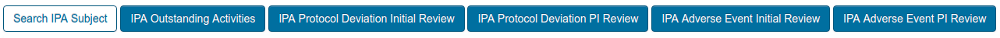
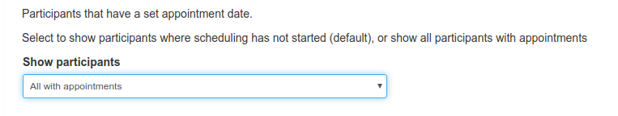
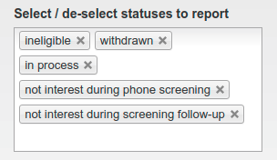
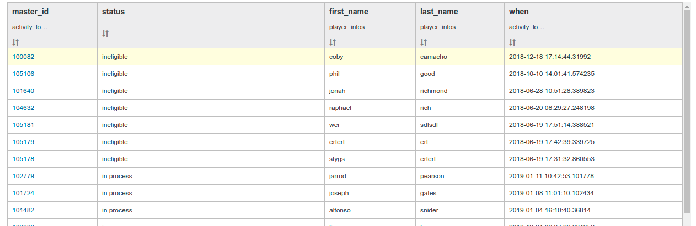
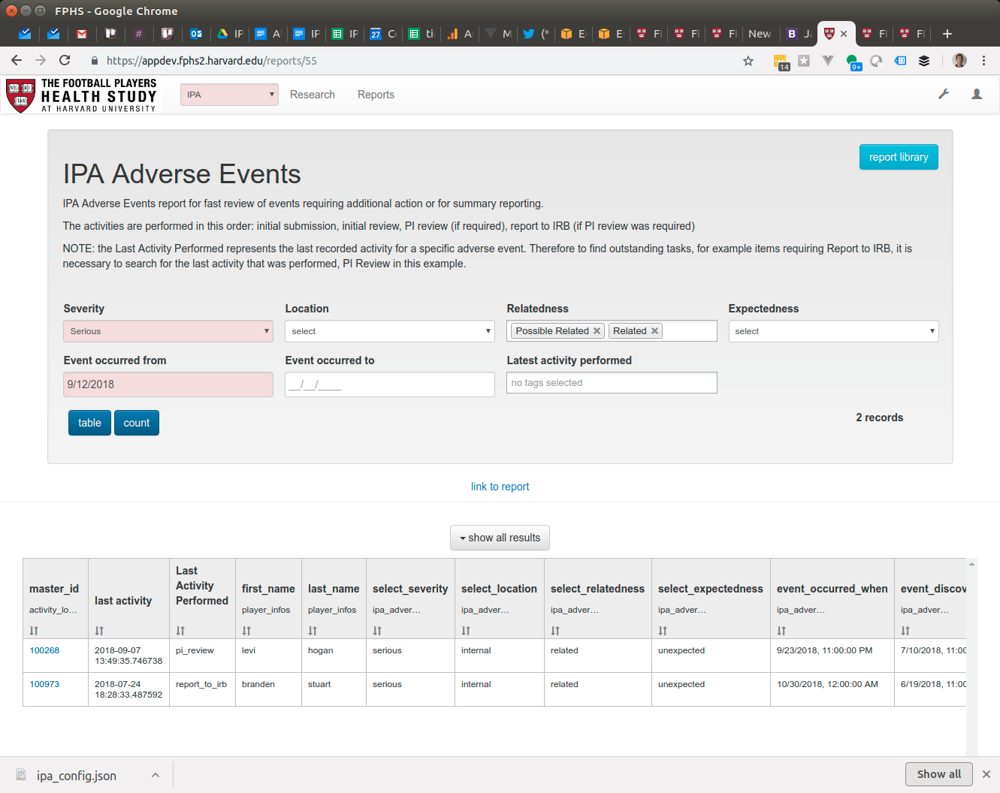
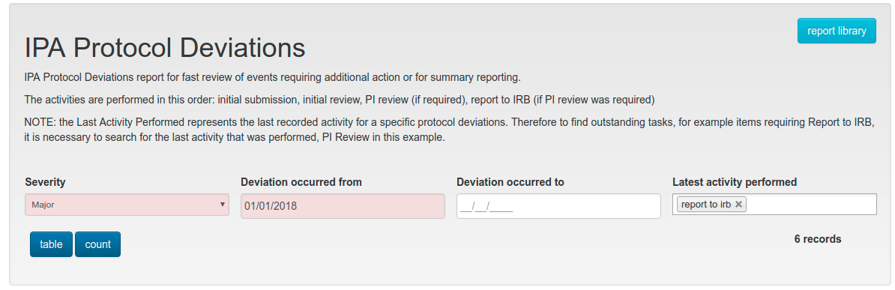
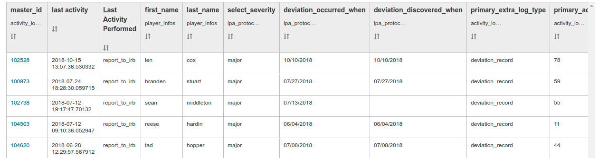
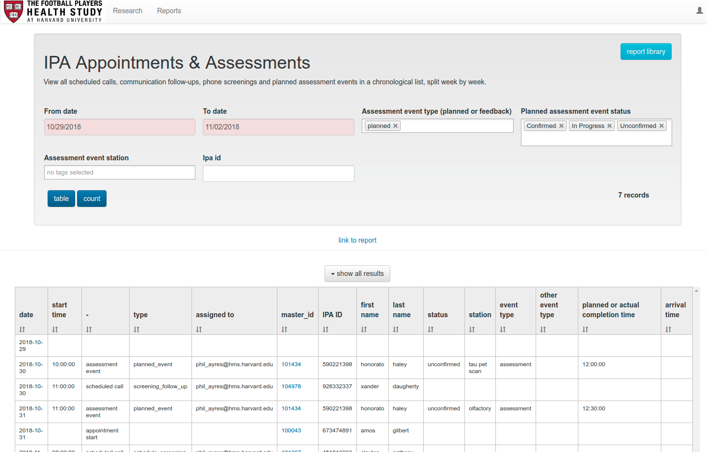
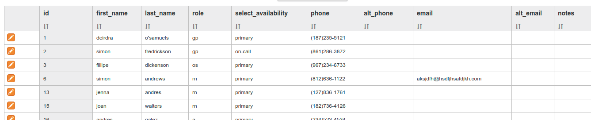

# Searches, Work Queues and Reports

Searches, work queues and reports are defined by an app administrator to meet the needs of app users. The current definitions are defined in the following sections.

## Searches and Work Queues

The following subsections describe each of the search and work queue buttons, and which roles of users can access them.

It should be noted that search and work queue results always appear as a list of participants. To view activities, for example those related to results from an IPA Protocol Deviation Initial Review search, it is necessary to click the relevant tab below the participant information, expanding the relevant panel showing all the activities that have been recorded.

### IPA ID Search

Available to: users without participant details privileges

Quickly find a participant by IPA ID

### Search IPA Subject

Available to: users with participant details privileges

Quickly find a participant by first or last name, phone number, email address or IPA ID

### Awaiting ADL Informant Screener

Available to: Inclusion / Exclusion users

List all participants requiring ADL Informant Screener where the screener response has not been received.

### Ready for Sign Off - PI / MedNav / Staff

Available to: Inclusion / Exclusion Staff Member, Med Nav reviewer, PI

List all participants with inclusion / exclusion checklist ready for sign off by the specific role.

### Ready for Sign Off - TMS

Available to: TMS Reviewer

List all participants with inclusion / exclusion TMS eligibility review ready for sign off by TMS group.

### Ready for Scheduling

Available to: Med Nav, Senior Clinical Research Coordinator

List all participants that have a set appointment date.

Select to show participants where scheduling has not started (default), or show all participants with appointments.

### Ready for Follow Up

Available to: IPA Tracker users

List all participants  with an appointment set that are ready for specific follow up activities. Select one of the following outstanding activities:

*   Emergency Contact Info
*   Transportation
*   Housing
*   Consent Mailing
*   Payments
*   Follow Up Surveys

### IPA Protocol Deviation Initial Review

Available to: Navigators, Senior Clinical Research Coordinator, PI

List all participants that have a Protocol Deviation that has not received an initial review.

### IPA Protocol Deviation PI Review

Available to: Navigators, Senior Clinical Research Coordinator, PI

List all participants that have a Protocol Deviation that has received an initial review, and currently requires the PI to record his review.

### IPA Adverse Event Initial Review

Available to: Navigators, Senior Clinical Research Coordinator, PI

List all participants that have an Adverse Event that has not received an initial review.

### IPA Adverse Event PI Review

Available to: Navigators, Senior Clinical Research Coordinator, PI

List all participants that have an Adverse Event that has received an initial review, and currently requires the PI to record his review.

### IPA Outstanding Activities

Available to: all users

Used to find subjects where a specific type of activity has been performed. Optionally, an outstanding activity can be specified, allowing a user to search for subjects where specific work is outstanding. This search allows for combinations that are not already offered as predefined queues / searches, described in the previous sections.

The default provides an example of this, finding subjects where a general communication has been marked as requiring follow-up, but a later activity has not been recorded as completed.

Other examples are:

*   Performed set appointment but consent mailing is outstanding
*   Performed scheduled screening follow-up but performed screening follow-up is outstanding
*   Performed scheduled screening follow-up but inclusion/exclusion checklist complete is outstanding
*   Performed scheduled screening follow-up but payment made is outstanding
*   Performed withdraw (with no outstanding activity specified) returns a list of all subject withdrawals recorded outside of the phone screen

- - -

## Reports

Reports are defined by app administrators to provide a tabular view of data for a rapid review of participant information and related data. The following sections describe the reports that have been defined.

### IPA In Process & Exited

Available to: all users

Review all participants with a specific status in the process:

*   In process  
    Phone screening scheduled, and no other exit condition has been met
*   CompletedA follow-up survey activity has been recorded in IPA Tracker
*   WithdrawnA withdraw activity has been recorded in IPA Tracker
*   Not interested during phone screenThe participant indicated he was not interested in continuing during the initial stage of the Phone Screen
*   IneligibleThe perform screening follow-up activity recorded the participant as ineligible for the study
*   Not interested during phone screening follow-upThe participant indicated he was not interested in continuing during the perform screening follow-up activity

Each option is set by selecting / deselecting the tag from the form:

Click table to run the report. A tabular list shows the participants and their statuses:

### IPA Adverse Events

Available to: Navigators, Senior Clinical Research Coordinator, PI

A tabular report allows for search and rapid review of the individual adverse events that are outstanding, or to prepare a bulk report to the IRB for lower importance items. This allows for any combination of the key fields to be used as search criteria:

*   Severity
*   Relatedness
*   Expectedness
*   Location
*   Date range
*   Latest activities recorded as completed

Click the table button to run the report and receive a table of results.

Each row provides key information from the event record, as well as a link to the full participant record.

NOTE: the Latest Activity Performed represents the last recorded activity for a specific adverse event. Therefore to find outstanding tasks, for example items requiring Report to IRB, it is necessary to search for the last activity that was performed, PI Review in this example.

The activities are performed in this order: initial submission, initial review, PI review (if required), report to IRB (if PI review was required).

### IPA Protocol Deviations

Available to: Navigators, Senior Clinical Research Coordinator, PI

IPA Protocol Deviations report for fast review of events requiring additional action or for summary reporting.

NOTE: the Last Activity Performed represents the last recorded activity for a specific protocol deviations. Therefore to find outstanding tasks, for example items requiring Report to IRB, it is necessary to search for the last activity that was performed, PI Review in this example.

The activities are performed in this order: initial submission, initial review, PI review (if required), report to IRB (if PI review was required).

To run the report, click the table button.

### IPA Appointments and Assessments

Available to: all users

View all scheduled calls, communication follow-ups, phone screenings and planned assessment events in a chronological list, split week by week. The report can be filtered by:

*   Date range
*   Assessment type

*   Planned
*   Feedback (record of actual assessment)

*   Assessment status

*   Confirmed
*   Unconfirmed
*   Canceled
*   In-Progress

*   Assessment station

*   Any of the specific assessment stations

*   IPA ID

The results alway start with a row that just contains the date representing the start of the week. Results that follow appear in that week. If results for multiple weeks are returned, each week’s set of results will have a row above it with just the week start date.

### Edit IPA Tech Contacts

Available to: Navigators, Senior Clinical Research Coordinator

View a list of all contacts that can be assigned to station assessment events. If necessary the individual entries may be edited directly by clicking the pencil icon on the start of the row, and saving the item with the check mark.

Remember that Tech Contact entries are typically shared by multiple Navigation process Planned Event records. Changing the details for a Tech Contact will be reflected in all places it is referenced.

