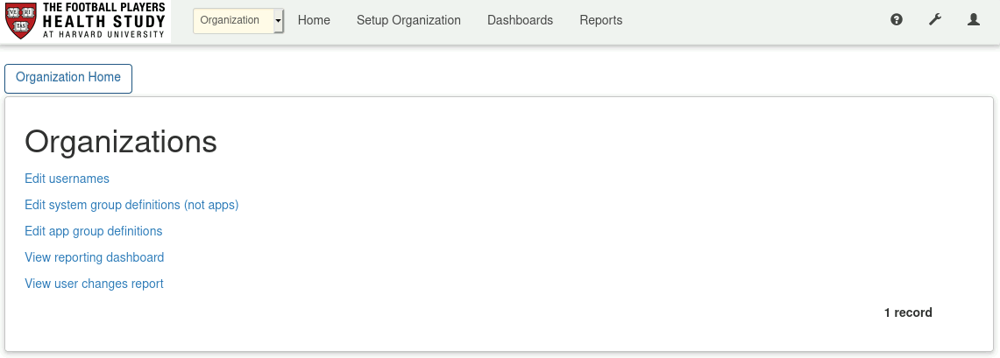
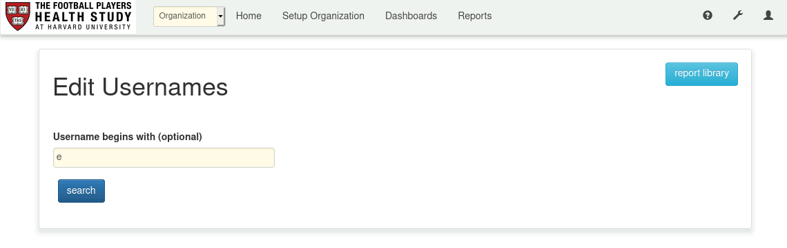
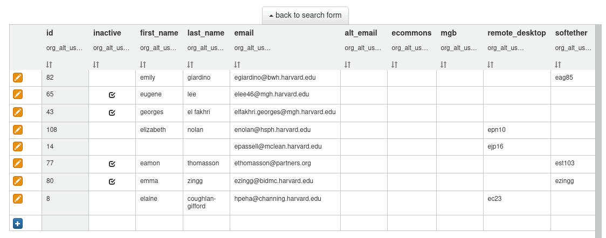
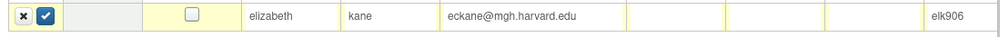
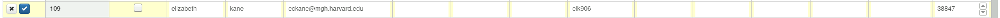
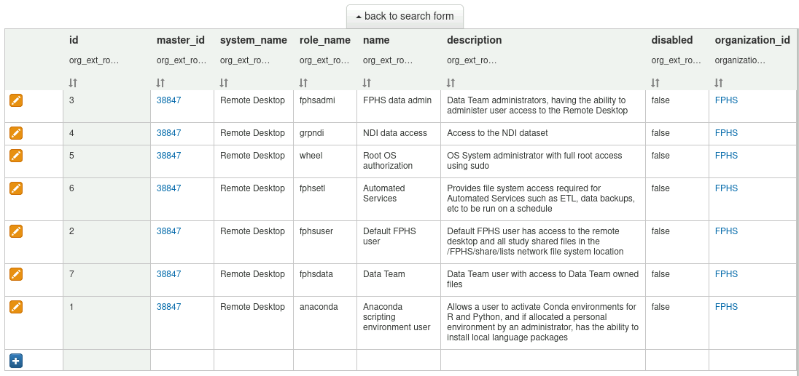

# Organization and User Reporting App

## Background

The **Organization and User Reporting** app provides a central location for the identification of FPHS information systems, servers and the users they support.

The app was motivated by the need for IT / Information Security compliance reporting of user assigned to systems, to ensure appropriate people across HMS are provided up-to-date reports. It has been extended to simplify the routine validation by the FPHS data team that the numerous servers and third-party services used by FPHS have the correct user assignments.

## Accessing the App

The *Organization and User Reporting* app may be accessed by privileged users on the Zeus server. For access, a user must have the following user roles:

- user - group reporting
- user - admin

This will allow the user to select the app named **Organization** in the Zeus app drop-down.

## Setting Identities and Groups Definitions

The app provides mechanisms to provide a single record of individual FPHS people and each of the identities and roles they have across systems and web apps.

The central database of users associates individuals with the usernames they have on each system. Alongside this, the groups / roles defined on each system and app may be given names that represent the business functions performed (group definitions), making them more meaningful that the groups / roles that assign the use of system level functions.

The *Organization* app home page provides access to view and edit information within the database.

## Viewing and Editing User Identities

To view and edit user identities, from the home page select **Edit usernames**. This shows a search form.

Search for users by name, username or any prefix to see a list of matches.

Edit individuals to change or add usernames on the different systems they have (or had) access to. Or to add a new user identity, click the blue **+** icon at the end of the list and enter the required fields.

**NOTE:** the final field must be populated by hand to match the record to the organization. In this field, enter the number **38847**, matching all the other records.

When all the fields are entered, press *Enter* or click the blue check icon at the start of the row.

## Deactivating Users

When a person should no longer have access to any FPHS systems, they should be marked as **inactive** in the username list. This provides a mechanism for centrally flagging user identities that should be removed across each of the FPHS systems, allowing the appropriate FPHS data team members to handle the systems they are responsible for.

To mark a person as inactive, edit the username record and check the checkbox in the **inactive** column, then save.

## Group Definitions

**Group Definitions** represent the business functions performed by individuals, which provide more meaningful descriptions than the system specific role names.

There are two types of *Group Definition*, one for Zeus and Athena apps, and another for other *external* systems.

On the home page, these are accessed via the links:

- Edit app group definitions
- Edit system group definitions (not apps)

### System Group Definitions

The *system group definitions* allow specific system roles (an OS group name on the remote desktop, for example) to be assigned a meaningful name and description.

To add an item, click the **+** icon at the end of the list and enter the details.

### App Group Definitions

The *app group definitions* are defined within the admin panel of the associated app server, Zeus, File Manager or Athena. Since they are a component of the actual app configuration, only app administrators have access to update the definitions.

After logging in as an administrator, click the link **Role Descriptions** under the **Users and Access** column.

