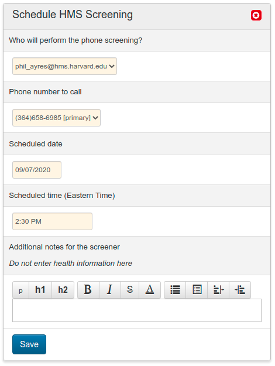
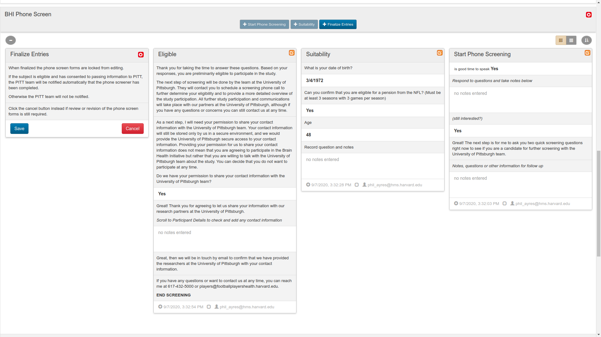
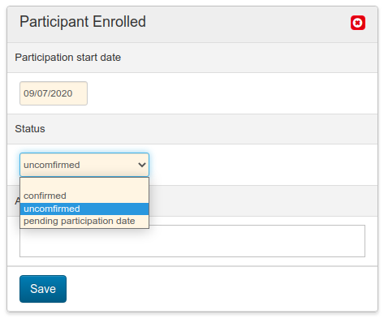
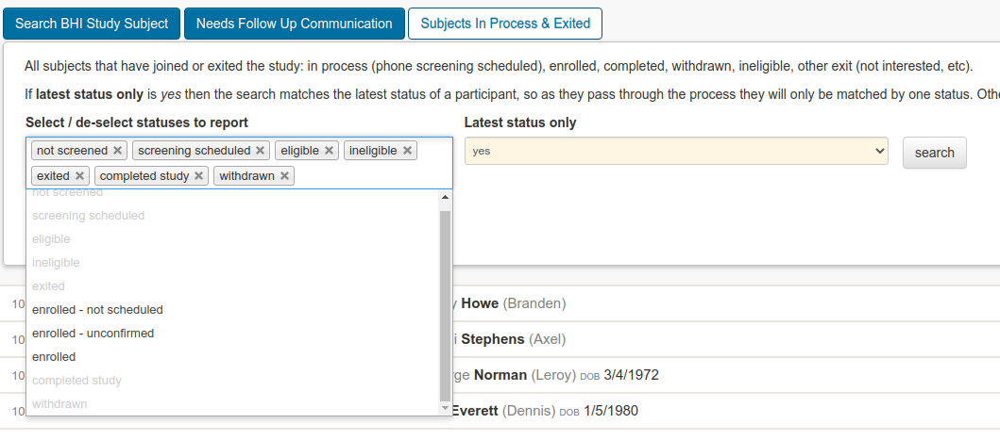
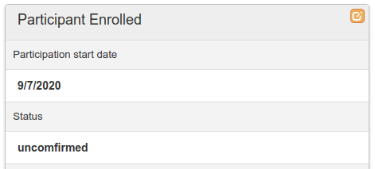
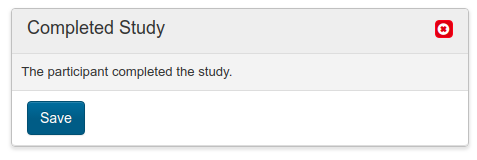
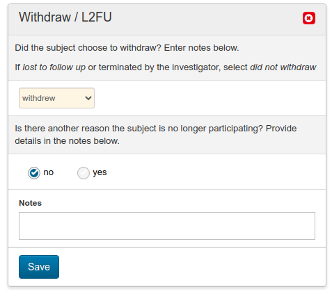
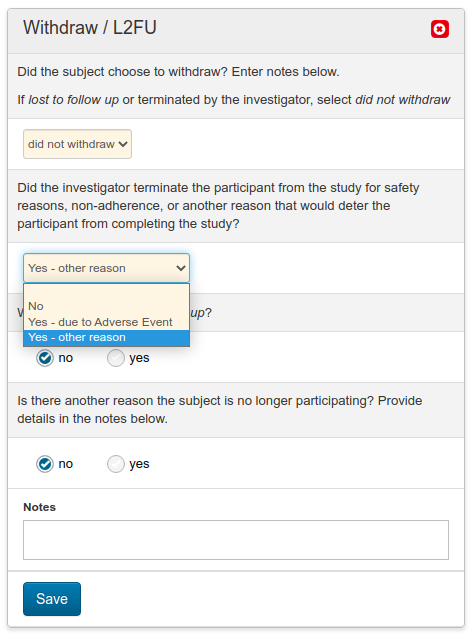
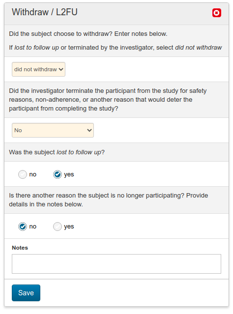

# Key Processes Guide

Each of the key processes specific to the PITT BHI Study and supported by the app are described in this section.

The narrative follows the most common sequence of activities from beginning to end, addressing major exceptions to the process where appropriate. Of course there are many other activities and tasks performed outside of the app that are not detailed here; their exclusion is purely for simplicity.

## Key Processes

### FPHS

* [Data Repository and Transfer to App](#fphs-data-repository-and-transfer-to-app)
* [Schedule HMS Screening](#fphs-schedule-hms-screening)
* [Phone Screen](#fphs-phone-screen)
* [Eligibility and Transfer](#fphs-eligibility-and-transfer)

### PITT

* [Receive Participant Information and Enrollment](#pitt-receive-information-and-enrollment)

### PITT and FPHS

* [Recording Exit, Withdrawal & Completion](#pitt--fphs-recording-exit-withdrawal--completion)

## FPHS: Data Repository and Transfer to App

FPHS analysts are responsible for identifying potential candidates for recruitment that meet the requirements of the study. These subject records are assigned FPHS PITT BHI IDs and appropriate Zeus tracker records by the FPHS Data Manager, transferring them to the PITT BHI App as a bulk action.

Zeus allows specific users to search for players that have a FPHS PITT BHI ID or a PITT BHI tracker record using the appropriate search tab. This allows for additional interactions (unrelated to recruitment and screening) with the player to be recorded.

In addition to bulk transfer of candidates to the app, individual players in Zeus may be transferred if they choose to opt in. When a player expresses an interest in the study, the FPHS Staff Member will enter a tracker entry, PITT BHI / opt in, indicating this. A PITT BHI ID should also be added in the external identifiers panel. An effect of this is to trigger a transfer of the player’s details, including contact information, over to Athena. A background process carries out this transfer within a few minutes.

Interactions related to the PITT BHI Study by staff with the participant should now be recorded by users in Athena rather than Zeus, through to the point that the participant eventually exits the study. Withdrawal, ineligibility and completion events are transferred back to Zeus and recorded in the tracker automatically.

## FPHS: Schedule HMS Screening

The Athena processes start when an FPHS Staff Member schedules a phone screening with the new subject, or calls a subject to screen them immediately.

If scheduling a future call, this should be recorded in Athena in the Recruitment & Logistics process. Adding this record helps other FPHS Staff from accidentally attempting to contact the same person. The record will also show in the Calendar, which can help for proactive scheduling.

## FPHS: Phone Screen

The phone screening is performed by following the phone screening script and recording responses directly within Athena.

The Phone Screen sections are split into individual forms, each automatically created and viewed in turn. The initial scripts and each of the questions are configured in Athena, allowing the user to work purely from the information presented on-screen. The series of forms are:

* Start Phone Screening
* Suitability
* Eligible or Ineligible
* Finalize Entries

The script and collection forms appear like this:

During the initial step, Start Phone Screening, an interviewer may select options such as having left a voicemail or a callback later was requested. In this case, the date and time for the callback can be entered into the form. This will automatically create a Schedule HMS Screening entry in the Recruitment & Logistics process, allowing the future callback to be tracked. On starting a new phone screening call in the future, add a new Start Phone Screening block.

Any of the screening forms may be edited up until the Finalize Entries form is saved. At this point in time, all phone screen forms are locked down and the eligibility and consent results of the phone screen are used to select the next steps in the process. The appropriate Eligible or Ineligible block will appear in the Recruitment & Logistics panel.

NOTE: if you cancel editing a current form then go back to a previous form to edit it, when you click Save the next form in the process will not automatically open. Instead, click the next active blue button in the top of the panel.

## FPHS: Eligibility and Transfer

Based on the result of a phone screening, one of the following blocks will be displayed in Recruitment & Logistics:

* HMS Phone Screen Eligible  
    The subject was found to be eligible in the HMS Phone Screen and consented to pass information to PITT.
* Ineligible  
    The subject was found to be ineligible.
* Exit During HMS Phone Screen  
    The subject exited during HMS phone screen, due to no interest or not giving consent to pass information to PITT.

If the subject is either ineligible, or exited due to no interest, or not giving consent to pass information to PITT, the process effectively ends and the rules described in [Study Exit](study_exit) will take over.

If the subject is eligible based on the phone screening, the process will continue, displaying new blue buttons in the Recruitment & Logistics panel header.

A subject’s information is not made visible to PITT Staff Members until the Transfer to PITT activity is completed by an FPHS Staff Member. This activity confirms that the participant has been emailed by the staff member, confirming their information has been sent. At this point, an automatic notification will be sent to PITT Staff Members informing them of the new subject’s information.

This represents the end of this subject’s process for the FPHS team, although they may still view activities, add Secure Notes, Supporting Files and Discussion messages.

## PITT: Receive Information and Enrollment

After receiving a notification from the app that a subject is eligible and his information has been transferred, a PITT Staff Member will be able to view the full history of activities performed in the Recruitment & Logistics and Phone Screen processes, and view the subject’s details and contact information. Clicking the link in the email notification will take you directly to the participant’s record (after logging in if needed.)

It is expected that most activities will be performed according to PITT BHI study procedures, returning to Athena to record key events, share files securely with the FPHS team, or send secure messages between teams.

### Recording Enrollment

A key event to record is when the participant has enrolled. In Athena the following buttons appear in the header of the Recruitment & Logistics panel:

Clicking  + Participant Enrolled reveals the following form:

Enter the Participation start date (the appointment) and the Status:

* Confirmed  
    The appointment date has been confirmed
* Unconfirmed  
    The appointment date has been provisionally set, but is not yet confirmed
* Pending participation date  
    An appointment date has not been set and a follow-up with the participant is required to set a date

### Finding participants

To facilitate follow-ups with participants that have enrolled, but do not yet have confirmed appointments, the search tab Subjects In Process & Exited provides three useful search options:

* enrolled - not scheduled

lists all subjects that are enrolled but do not have a participation date or status set

* enrolled - unconfirmed  
    lists all subjects that are enrolled but have status set to unconfirmed
* enrolled  
    lists all subjects that are enrolled and have a confirmed participation date

### Changing Participation Status

To change the participation status of a participant, click the orange edit button in the Participant Enrolled block, change the status and date as required, then click Save.

## PITT & FPHS: Recording Exit, Withdrawal & Completion

Key events that can be recorded by the PITT or FPHS teams prior to enrollment are:

* Exit (Opt-Out)
* Lost to Follow Up

After enrollment has been recorded (whether an appointment date has been confirmed or not), the key events that can be recorded are:

* Completed Study
* Withdraw / L2FU

The events are separated by enrollment status, allowing detailed analysis of recruitment and engagement of participants.

For all these activities (except for Withdraw / L2FU,) recording an event is as simple as clicking the appropriate button in the header…

… then clicking Save in the block that appears.

Withdraw / L2FU works differently and captures more detail in its form. To record a participant requesting to withdraw, select withdrew in the first field:

If the participant did not actively choose to withdraw, instead select did not withdraw in the first field, then answer the remaining questions.

In the unlikely scenario that the investigator must terminate the participant, due to an adverse event or other reason, select the appropriate response.

If the participant was not terminated by the investigator, select No then select if instead the participant was lost to follow up or is not participating for any other reason.

In all cases, after exit, withdrawal or completion, the participant’s records will pass to the [Study Exit](study_exit) rules.
