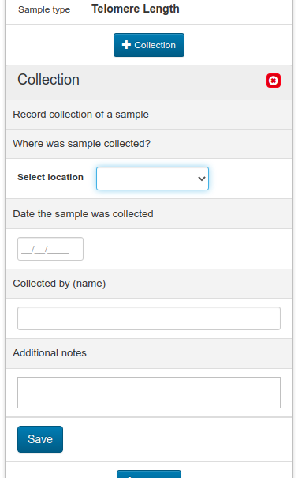

# IPA Athena: Sample Lifecycle Tracking

The FPHS IPA Athena app supports the tracking of samples through their lifecycle, from initial consent and collection, through to eventual destruction.

This document describes use of the processes and logging provided within the app, from the point of view of telomere length samples, the first participant samples to be tracked with the app. A detailed description of the general usage of the Athena App is available [here](https://www.google.com/url?q=https://docs.google.com/document/d/1cYNyz43JhVoIvnhqLlOBiMAExBaFDxiQEUHqR8yJ7lA/edit&sa=D&source=editors&ust=1620922722977000&usg=AOvVaw0Z2MnQheGvAPKfxkrKdTgt).

## Recruitment

Initial recruitment of existing and potential IPA participants to provide telomere length saliva samples is tracked within the IPA Tracker panel in Athena. At any point after a subject has been transferred to Athena for study recruitment, an activity is available to record participant calls for telomere length participation.

Clicking the \+ Telomere Participation Call button in the IPA Tracker reveals an activity block to record the outcome of a call.

The question “Did you connect and complete the call” provides responses:

* Yes
* Yes, but call back
* No, left voicemail
* No, no voicemail

For anything other than Yes, a call back date and time may be entered. These callbacks will appear in the IPA Calendar.

If the response is Yes, and the participant would like to participate in telomere length samples, the date of UPS scheduled pick up should be entered.

Once saved, the block presents a button \+ Generate New ID for Sample, allowing a new sample tracking ID number to be created immediately.

Clicking the button allows the sample type to be selected, then just click Save to generate a random ID.

The end of the block will now show the newly created ID

The tracking of the sample lifecycle process has been triggered.

## Sample Tracking

In order to track the lifecycle of a sample, to gain a quick view of its current status and custody, the Sample Tracking panel shows each sample associated with a participant. The generation of the telomere sample ID previously leads to a Sample block being shown.

As new sample types are added, clicking the \+ Sample button in the header of the Sample Lifecycle header will allow tracking of additional samples related to the participant.

The sample tracking block for telomere length shows buttons for each of the key activities to be tracked for a sample.

Clicking the appropriate button to add a record of an activity will show the relevant form directly underneath, allowing details of the activity to be entered. When saved, a row will be added showing a summary of the action.

Clicking the caret ▼ icon to the left of a row expands the full information related to the activity.

Clicking the x icon to the right of a row allows the record to be removed. This deactivates the record by graying it out, but does not actually delete the data, avoiding the chance that records can be accidentally (or maliciously) destroyed.

In this way, a full lifecycle history for a sample can be recorded. The following sections summarize each activity.

- - -

### Collection

Record the collection of a sample, selecting the location it was collected, the date collected and the name of the person collecting it. If the participant was responsible for collecting the sample himself, entering “participant” will be sufficient.

### Consent

Additional consents related to the sample may be recorded if necessary. If a more broad consent already covers this sample, recording it here may not be considered necessary.

Multiple consent types may be recorded on a single form by selecting the appropriate items.

### Withdraw Consent

If it is necessary to record a previously recorded consent being withdrawn, expand the specific consent from the list.

Click the \+ Withdrew Consent button to provide details for the consent being withdrawn.

### Transport

Record a sample that has been transported by a carrier such as UPS, with the details of the carrier, when a package was picked up, the original and return package tracking numbers.

### Store

Storage details for a sample include the date received, any problems with the samples received, the physical location stored, the number of units and their volume.

### Request Sample

To record requests for a sample that were not otherwise planned, enter the details into the form.

When saved, the request that appears in the list may be dropped down, revealing an approval button that can record any approvals required.

...

### Withdraw Sample

To record an individual sample withdrawn from storage, enter details about the withdrawal.

A prompt at the end of the form reminds the user to add a transport record if transport by a carrier such as UPS is used to deliver the withdrawn sample.

#### Split Aliquot

Importantly, if a new ID is required, for example if the sample is to be split, or to maintain deidentification, select yes to the question Is a new ID required? This will reveal an additional prompt.

After saving, expand the Withdraw Sample item in the list. At the bottom of the form, a new button is provided.

...

Clicking the button allows selection of the type of sample, registering it with a new ID similar to the start of the process.

When saved, a new sample block will appear in the Sample Tracking panel indicating the new ID for the sample.

In the original sample block, expanding the Withdraw Sample item in the list will also show the new sample ID at the bottom of the form.

### Destruction

When samples are due for destruction, the Destroy form allows details of the destruction to be recorded.

After saving, the Destroy item in the list may be expanded, showing options to record approval and confirmation of destruction if required.

These forms appear like this:

### Add Notes

To record additional notes at any point through the process, add a Notes block, allowing entry of freeform notes.

### Add Documents

File attachments may be added if necessary, for example to provide evidence of approvals for withdrawal or destruction. First, save a new container for these files, providing a short description of the files to be added.

When saved, drop down the Supporting Files list item and add files to the container.

Full usage details for the file uploader are available in the document [Athena, the In-Person Assessment App](https://www.google.com/url?q=https://docs.google.com/document/d/1cYNyz43JhVoIvnhqLlOBiMAExBaFDxiQEUHqR8yJ7lA/edit%23heading%3Dh.v6g8ud3x2qly&sa=D&source=editors&ust=1620922722987000&usg=AOvVaw2YwxfGkMpLBvboqLkgkB4U)

## Search

To find the participant record a specific sample ID belongs to, use the IPA Samples Search tab in the search bar.

The matching participant record will be returned if the ID is found.

## Authorizations

By default, IPA users of Athena are not granted access to the sample tracking functionality.

Within the Athena administration panel, users are granted access to the sample tracking functionality by granting each user the role user - sample admin. This provides full search and editing rights for the samples.

If required in the future, Athena can be configured to allow only read-only access to certain activities and information in the sample tracking interface.

IPA Athena: Sample Lifecycle Tracking        Version 1.0        Page  of
